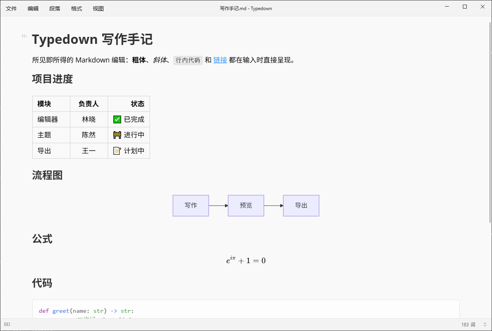
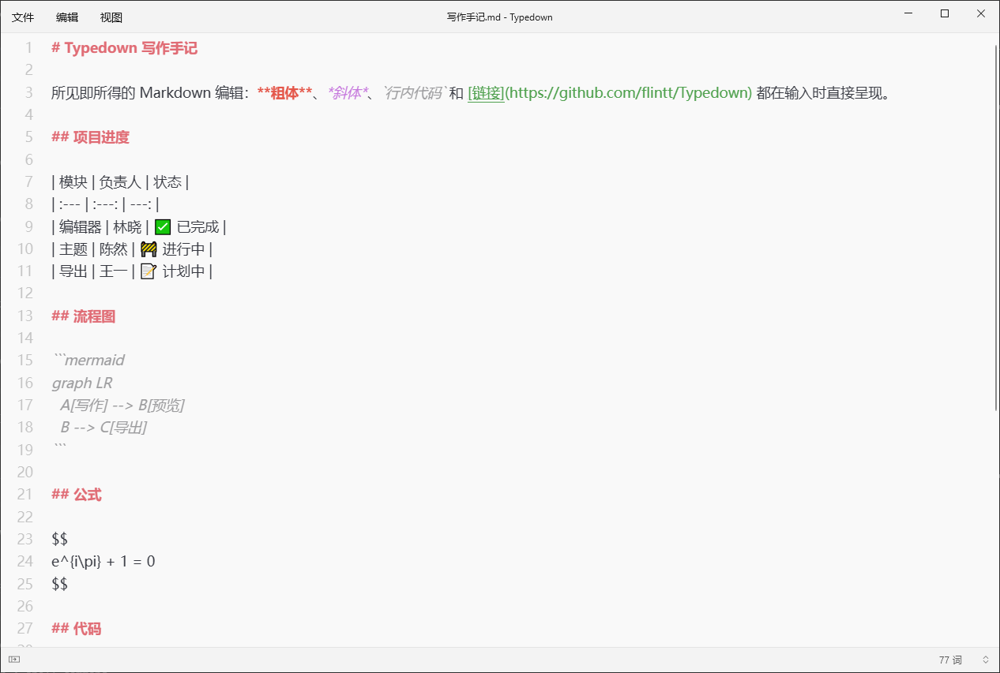
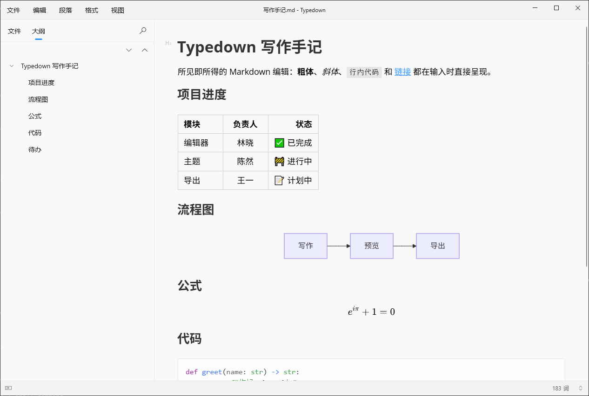
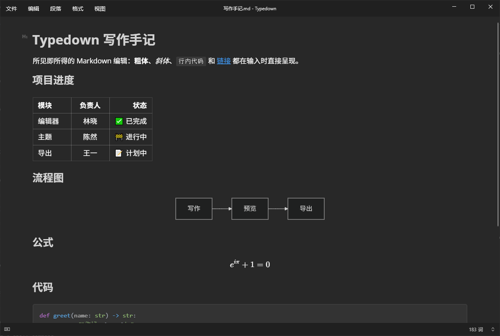

<p align="center">
  
  <h1 align="center">Typedown</h1>
</p>

<p align="center">
  <a href="https://github.com/flintt/Typedown/releases/latest"></a>
  <a href="https://github.com/flintt/Typedown/releases"></a>
  <a href="LICENSE"></a>
</p>

Windows 平台的所见即所得 Markdown 编辑器，WinUI 界面，编辑内核来自 MarkText 的 Muya。
本仓库是 [byxiaozhi/Typedown](https://github.com/byxiaozhi/Typedown) 的 fork，在上游基础上持续修 bug、加功能（多标签、全文搜索、会话恢复、HedgeDoc 分享、阅读模式、自定义主题、供脚本和 AI 助手使用的本机自动化……），每个版本的具体改动见 [Releases](https://github.com/flintt/Typedown/releases)。

> A WYSIWYG Markdown editor for Windows (WinUI), forked from [byxiaozhi/Typedown](https://github.com/byxiaozhi/Typedown)
> and developed further: document tabs, folder-wide search, session restore, HedgeDoc sharing, reading mode, custom
> themes, and local automation for scripts and AI assistants (a CLI and an MCP server).
> See the [releases](https://github.com/flintt/Typedown/releases) for what each version changed. It is also in the
> Microsoft Store as [Typeleaf](https://apps.microsoft.com/detail/9nxbvhm4k005).

## 下载

去 **[最新发布](https://github.com/flintt/Typedown/releases/latest)** 下载，x64 和 ARM64 都有：

| 文件 | 说明 |
|---|---|
| `Typedown-windows-x64-*.exe` / `-arm64-*.exe` | 安装包，一路下一步即可 |
| `Typedown-portable-x64-*.zip` / `-arm64-*.zip` | 便携版，解压即用，不写注册表 |
| `Typedown_*_x64.msix` / `_ARM64.msix` | MSIX 包；需要先安装同一发布里的 `Typedown-signing-certificate.cer` 到「受信任的根证书颁发机构」 |

也可以从微软商店安装 **Typeleaf**：本仓库在微软商店上架的版本，由商店安装和自动更新，不用手动导入证书。

<a href="https://apps.microsoft.com/detail/9nxbvhm4k005?referrer=appbadge&mode=direct">
  
</a>

跨平台（Linux / macOS）请用 Uno 移植版：**[flintt/Typedown-Uno](https://github.com/flintt/Typedown-Uno/releases/latest)**。

上游作者在微软商店上架的是**上游版本**，不含本仓库的改动：[Microsoft Store](https://apps.microsoft.com/detail/9p8tcw4h2hb4)。

主题可以自己写：一个 CSS 文件放进主题文件夹即可，格式见 **[自定义主题](docs/custom-theme.md)**；也可以直接打开 **[中英双语主题配色工具](https://flintt.github.io/Typedown/)**，在浏览器中设计、导入和导出主题。

脚本和 AI 助手可以读写你打开的文档、切换窗口的模式和侧栏、调整设置：在 设置 → 通用 里打开“允许本机自动化”（默认关闭）。安装目录里的 `typedownctl.exe` 是命令行工具，`typedownctl mcp` 是给 AI 工具用的 MCP 服务器；用法、能做的事和安全边界见 **[本机自动化](docs/automation.md)** 和 **[MCP](docs/automation-mcp.md)**。

遇到问题请开 [issue](https://github.com/flintt/Typedown/issues/new/choose)，写清楚版本号（设置 → 关于）、复现步骤和日志（`%LOCALAPPDATA%\Typedown\logs\`）。本仓库的 issue 由 AI（Claude Code）分析和修复。

## 截图

| 可视编辑 | 源码模式 |
|:--:|:--:|
|  |  |
| **大纲** | **深色主题** |
|  |  |

这些截图由 [Tools/Screenshots](Tools/Screenshots) 在一个运行中的 Typedown 里只用本机自动化接口拍下（切换语言、文档、模式、侧栏和主题，不重启）。

## Building from source

维护者文档：[当前架构](docs/architecture.md) · [WebView 消息协议](docs/editor-protocol.md) · [本地化规范](docs/localization.md) · [打包与发布](PACKAGING.md) · [Windows 真机验证](docs/windows-verification.md)

### 1. Prerequisites
[Visual Studio 2022](https://visualstudio.microsoft.com/vs/) with the following individual components:
  - .NET Core 3.1 SDK
  - Git for Windows

[Node.js](https://nodejs.org/) with the following global packages:
  - [yarn](https://yarnpkg.com/)

### 2. Clone the repository
```ps
git clone https://github.com/flintt/Typedown
```

This will create a local copy of the repository.

### 3. Build the project
First go to the directory `Typedown\Dev\Typedown.Editor` and run `yarn && yarn build`

```ps
cd Typedown\Dev\Typedown.Editor
yarn && yarn build
```


After finishing the compilation of `Typedown.Editor`, you can see the generated product in the directory `Typedown\Dev\Typedown\Resources\Statics`.

Then use VisualStudio 2022 to open `Typedown\Typedown.sln`, right-click on the Typedown project and select Set as Startup Project.

In the top pane, select the solution configuration you want to build in, the difference between these configurations is as follows
- Debug: The `Typedown.Editor` will be accessed using the http://localhost:3000 address, to use this configuration you need to also start the Typedown.Editor project using yarn start in the Typedown\Dev\Typedown.Editor directory.
- Debug_Local: The `Typedown.Editor` will be accessed using the compiled product (Typedown\Dev\Typedown\Resources\Statics)
- Release: Used when releasing a project

Then select the platform you want to build on (x64, x86, or arm64) and click Run!


### Contributors
Want to contribute? Open an [issue](https://github.com/flintt/Typedown/issues) describing what you intend to
change before sending a [pull request](https://github.com/flintt/Typedown/pulls). Upstream discussions belong
in [byxiaozhi/Typedown](https://github.com/byxiaozhi/Typedown/issues).

## 许可证

MIT，沿用上游的许可证（见 `LICENSE`）。编辑内核来自 [MarkText](https://github.com/marktext/marktext) 的 Muya（同为 MIT）。
