# Markdown Editor Showcase

This document is a test fixture and a side-by-side comparison sheet. Every section starts with a line in
*italics* saying what it checks. Where a feature is an extension rather than CommonMark/GFM, the section says so;
where something is written on purpose to *not* work in this editor, it is labelled **(not supported here)**.

[TOC]

*The line above is `[TOC]`. Typora and MarkText replace it with a table of contents. This editor shows it as text while editing and puts a table of contents in its place when exporting to HTML or PDF. GitHub, Obsidian and VS Code show it as text.*

---

## 1. Headings

*Checks: ATX headings of every level, setext headings, inline formatting inside headings, closing hashes, and lines that only look like headings.*

# Level 1 heading

## Level 2 heading

### Level 3 heading

#### Level 4 heading

##### Level 5 heading

###### Level 6 heading

####### Seven hashes is not a heading, it is a paragraph

Setext level 1
==============

Setext level 2
--------------

### Heading with **bold**, *italic*, `code`, ~~strike~~ and a [link](https://example.com)

### Closed heading with trailing hashes ###

#### Trailing hashes that do not match in number ##########

### A heading that ends in a hash in code `#`

#5 is not a heading because there is no space after the hash, and neither is #hashtag.

\# An escaped hash is a paragraph too.

   ### Indented by three spaces is still a heading

## 2. Paragraphs and line breaks

*Checks: soft breaks, hard breaks (two trailing spaces and backslash), very long lines, and blank-line handling.*

This paragraph is written across
several source lines with plain newlines.
A CommonMark renderer joins them with a space (a soft break);
some editors show them as separate lines.

This line ends with two spaces  
so the next line starts after a hard break.

This line ends with a backslash\
so the next line starts after a hard break in CommonMark (not supported here: this editor shows the backslash and a soft break).

This line uses an inline HTML break<br>to move to the next line.

A very long line without any manual wrapping, to see whether the editor wraps it softly at the window edge and whether the line stays one line when the document is saved again, which matters for diffs: the quick brown fox jumps over the lazy dog while the lazy dog dreams about the quick brown fox, and both of them are eventually overtaken by a slow but persistent tortoise that never stopped walking.

An unbroken token that cannot wrap at spaces: Supercalifragilisticexpialidocious_and_then_some_more_characters_until_it_is_longer_than_any_reasonable_window_width_0123456789_abcdefghijklmnopqrstuvwxyz_ABCDEFGHIJKLMNOPQRSTUVWXYZ.


Three blank lines above this paragraph collapse to one paragraph break.

## 3. Scripts, languages and emoji

*Checks: mixed CJK and Latin text, Japanese and Korean, right-to-left paragraphs, combining characters, and emoji written literally or as shortcodes.*

Mixed CJK and Latin: 我们在 2026 年用 Markdown 写文档，`git commit` 之后再推送到 GitHub。中英文之间有没有空格，是排版上常见的争论。

Japanese: 吾輩は猫である。名前はまだ無い。どこで生れたかとんと見当がつかぬ。カタカナとひらがな、そして漢字が混ざっています。

Korean: 마크다운은 읽기 쉽고 쓰기 쉬운 텍스트 형식입니다.

Arabic (right to left): مرحبا بالعالم. هذه فقرة مكتوبة باللغة العربية لاختبار اتجاه النص من اليمين إلى اليسار، وفيها رقم 2026 وكلمة Markdown.

Hebrew (right to left): שלום עולם. זוהי פסקה בעברית כדי לבדוק כתיבה מימין לשמאל.

Combining characters: e&#x301; written as an entity, and é ñ ü written as precomposed letters; Vietnamese: Tiếng Việt có dấu.

Literal emoji: 😀 🎉 👍🏽 👨‍👩‍👧‍👦 🏳️‍🌈 ❤️ 🇨🇳 🇯🇵

Emoji shortcodes (an extension; GitHub and this editor render them, many editors show the text): :smile: :tada: :rocket: :+1: :white_check_mark:

An unknown shortcode stays text: :this_is_not_an_emoji:

Time stamps are not shortcodes: 10:30:45.

## 4. Emphasis and inline formatting

*Checks: emphasis edge cases, strikethrough, inline code with backticks, highlight, and inline HTML formatting tags.*

Plain *italic* and _italic_, **bold** and __bold__, ***bold italic*** and ___bold italic___.

Nested: **bold with *italic* inside**, *italic with **bold** inside*, ~~strike with **bold** inside~~.

Intraword: un*frigging*believable works with stars; snake_case_variable_name and __init__ should stay plain with underscores in words.

Arithmetic is not emphasis: 2 * 3 * 4 = 24, and a lone * star or _ underscore stays literal.

Unclosed markers stay literal: **this is not closed, and *neither is this.

Strikethrough (GFM): ~~deleted text~~ and ~~two words~~ in a row.

Inline code: `const x = 1;`, with a backtick inside: `` a`b ``, two backticks inside: ``` a``b ```, and a code span that is only a backtick: `` ` ``.

Inline code keeps markup literal: `**not bold**`, `<b>not HTML</b>`, `$not math$`.

Highlight (extension, `==text==`): ==highlighted words== and ==highlight with **bold** inside==.

Inline HTML formatting: <u>underlined</u>, <ins>inserted</ins>, <small>small print</small>, <abbr title="HyperText Markup Language">HTML</abbr>, <span style="color: #c0392b;">red text</span>, H<sub>2</sub>O and E = mc<sup>2</sup>, <mark>mark element</mark>.

Ruby annotation: <ruby>漢字<rt>かんじ</rt></ruby> and <ruby>拼音<rt>pīn yīn</rt></ruby>.

Keyboard keys: press <kbd>Ctrl</kbd> + <kbd>Shift</kbd> + <kbd>P</kbd>.

## 5. Links

*Checks: inline, titled, reference-style, autolinks, bare URLs, URLs with parentheses and spaces, mailto, and anchors to headings in this document.*

- Inline link: [Example Domain](https://example.com)
- Link with a title: [hover me](https://example.com/docs "The documentation title")
- Link with single-quoted title: [single](https://example.com/single 'Single quotes')
- URL with parentheses: [Markdown (disambiguation)](https://en.wikipedia.org/wiki/Markdown_(disambiguation))
- Destination in angle brackets with spaces: [a file name](<./notes/my notes.md>)
- Link with formatting in its text: [**bold** and `code` link](https://example.com/formatted)
- Reference link, full: [the reference][ref-full]
- Reference link, collapsed: [ref-collapsed][]
- Reference link, shortcut: [ref-shortcut]
- Reference names are case-insensitive: [Upper Case Ref][REF-FULL]
- Autolink: <https://example.com/autolink>
- Email autolink: <hello@example.com>
- Bare URL (GFM extended autolink): https://example.com/bare/path?query=1&lang=en#part
- Bare www link: www.example.com
- Bare email: support@example.com
- Mailto link: [write to us](mailto:hello@example.com?subject=Showcase)
- Anchor to a heading: [jump to Tables](#11-tables), [jump to Math](#14-math), [jump to the Chinese section](#19-中文段落)
- Anchor to a heading with formatting: [heading with formatting](#heading-with-bold-italic-code-strike-and-a-link)
- Link to a missing reference stays text: [no such reference][nowhere]
- Empty link text: [](https://example.com/empty)

[ref-full]: https://example.com/reference "Reference title"
[ref-collapsed]: https://example.com/collapsed
[ref-shortcut]: <https://example.com/shortcut> 'Shortcut title'

## 6. Images

*Checks: relative local images, titles, spaces in paths, reference images, sized HTML images, SVG, and a broken image. No web images are used, so the document renders the same offline.*

A PNG with a relative path:


A JPEG with a `./` path and a title:


An SVG image inline in a sentence: 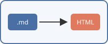 followed by more text.

A path with spaces, percent-encoded and in angle brackets:

 

A reference-style image: ![landscape by reference][landscape-ref]

[landscape-ref]: images/landscape.png "Reference image"

An HTML image with a size and alignment:


<p align="center"></p>

A broken image (the file does not exist on purpose):


An image inside a link: [](https://example.com/gallery)

## 7. Block quotes

*Checks: nested quotes, quotes containing lists, code, headings and paragraphs, and lazy continuation lines.*

> A single-level quote with **formatting** and a [link](https://example.com).
>
> A second paragraph in the same quote.

> Level one
> > Level two
> > > Level three, the deepest one here.
> >
> > Back to level two.
>
> Back to level one.

> #### A heading inside a quote
>
> - a list item inside a quote
> - another item
>   1. a nested ordered item
>
> ```python
> def quoted():
>     return "code inside a quote"
> ```
>
> - [ ] a task inside a quote
> - [x] a finished task inside a quote

> This quote line is followed by a lazy continuation line
that has no `>` marker but belongs to the quote in CommonMark (not supported here: this editor ends the quote and starts a paragraph).

> **Note**
> A common way to write a callout that works everywhere.

## 8. Lists

*Checks: bullet markers, ordered lists starting at other numbers, the `)` delimiter, tight versus loose lists, nesting of mixed kinds, and items holding several paragraphs and code.*

A tight bullet list:

- apples
- pears
- plums

Other bullet markers (each one starts a new list in CommonMark):

* star item one
* star item two

+ plus item one
+ plus item two

An ordered list starting at seven:

7. seventh
8. eighth
9. ninth
10. tenth, where the number grows one digit wider

An ordered list with the parenthesis delimiter:

1) first
2) second

An ordered list whose numbers are all the same in the source:

1. one
1. two
1. three

A loose list (blank lines between items):

- The first item of a loose list.

- The second item, which is rendered as a paragraph.

- The third item.

Nested mixed list:

1. Fruit
   - apples
     - Granny Smith
     - Honeycrisp
   - citrus
     1. oranges
     2. lemons
2. Vegetables
   - carrots
3. Grains

An item with several paragraphs and a code block:

1. Install the dependencies.

   This second paragraph belongs to the first item because it is indented.

   ```bash
   npm ci
   npm run build
   ```

2. Run the tests.

   > A quote inside a list item.

3. Ship it.

## 9. Task lists

*Checks: GFM task lists, checked and unchecked, upper-case X, nesting, and formatting in task text.*

- [x] Write the outline
- [x] Draft every section
- [ ] Review the **tables** and `code`
  - [x] Alignment
  - [ ] Escaped pipes
    - [ ] Third level task
- [X] Upper-case X is checked too
- [ ] A task with a [link](https://example.com/tasks)

Ordered task lists (GitHub renders checkboxes; not supported here: the brackets stay text):

1. [x] An ordered task
2. [ ] Another ordered task

## 10. Code

*Checks: syntax highlighting for many languages, unknown and missing languages, info strings with attributes, indented code, fences that contain fences, and very long code lines.*

```js
// JavaScript
export async function load(url) {
  const res = await fetch(url, { headers: { Accept: 'text/markdown' } });
  if (!res.ok) throw new Error(`HTTP ${res.status}`);
  return res.text();
}
```

```ts
// TypeScript
interface Heading { level: 1 | 2 | 3 | 4 | 5 | 6; text: string }
const slug = (h: Heading): string => h.text.toLowerCase().replace(/\s+/g, '-');
```

```python
# Python
from dataclasses import dataclass

@dataclass
class Note:
    title: str
    words: int = 0

    def summary(self) -> str:
        return f"{self.title}: {self.words} words"
```

```csharp
// C#
public sealed record Document(string Path, string Text)
{
    public int Lines => Text.Split('\n').Length;
}
```

```json
{
  "name": "showcase",
  "private": true,
  "tags": ["markdown", "test"],
  "nested": { "ok": true, "count": 3, "nothing": null }
}
```

```yaml
# YAML
site:
  title: "Showcase"
  languages: [en, zh, ja]
  build:
    minify: true
```

```bash
#!/usr/bin/env bash
set -euo pipefail
for f in *.md; do
  echo "Checking $f"
  wc -l "$f"
done
```

```powershell
# PowerShell
Get-ChildItem -Filter *.md -Recurse |
    Where-Object { $_.Length -gt 1KB } |
    ForEach-Object { "{0,-40} {1,8}" -f $_.Name, $_.Length }
```

```sql
-- SQL
SELECT d.title, COUNT(t.id) AS tag_count
FROM documents AS d
LEFT JOIN tags AS t ON t.document_id = d.id
WHERE d.updated_at >= '2026-01-01'
GROUP BY d.title
ORDER BY tag_count DESC;
```

```html
<!doctype html>
<html lang="en">
  <head><meta charset="utf-8"><title>Preview</title></head>
  <body><article class="markdown-body">Hello</article></body>
</html>
```

```css
.markdown-body table th:nth-child(2) {
  text-align: center;
  background: color-mix(in srgb, var(--accent) 12%, transparent);
}
```

```diff
- const old = require('old-parser');
+ import { parse } from 'new-parser';
  const doc = parse(text);
@@ -10,3 +10,4 @@
```

```markdown
# A Markdown sample inside a code block

- **not rendered**, just highlighted
- [link](https://example.com)
```

```nosuchlanguage
An unknown language name: shown as plain code, no highlighting, no error.
```

```
A fence with no language at all.
    Indentation inside is kept.
```

```ts {title="slug.ts" linenos}
// An info string with attributes after the language
export const answer = 42;
```

~~~markdown
A tilde fence can contain a backtick fence:

```js
console.log('inside');
```
~~~

````text
A four-backtick fence can contain a three-backtick fence:
```
still inside the outer block
```
````

    This is an indented code block (four spaces).
    It has no language and no fence.
        Extra indentation is part of the code.

```js
const aVeryLongLine = "This string is deliberately long so that the code block has to scroll horizontally or wrap, depending on the editor: 0123456789 0123456789 0123456789 0123456789 0123456789 0123456789";
```

```text
```

## 11. Tables

*Checks: column alignment, inline formatting in cells, escaped pipes, code containing pipes, empty cells, a wide table, and CJK content.*

| Left aligned | Centred | Right aligned | Default |
|:-------------|:-------:|--------------:|---------|
| apple        | 1       | 1.00          | plain   |
| banana       | 22      | 22.50         | text    |
| cherry       | 333     | 333.333       | here    |

| Formatting | Example |
|---|---|
| Bold and italic | **bold** and *italic* |
| Code | `npm run build` |
| Link | [example](https://example.com) |
| Strike and highlight | ~~old~~ ==new== |
| Inline math | $a^2 + b^2 = c^2$ |
| Escaped pipe | a \| b |
| Code with a pipe | `x \|\| y` |
| HTML break | first line<br>second line |
| Emoji | :rocket: 🚀 |

| Empty cells | B | C |
|---|---|---|
| only first |  |  |
|  | only middle |  |
|  |  | only last |

A wide table with many columns:

| ID | Name | Category | Region | Q1 | Q2 | Q3 | Q4 | Total | Change | Owner team | Notes |
|---:|------|----------|--------|---:|---:|---:|---:|------:|:------:|------------|-------|
| 1 | Widget | Hardware | North | 120 | 135 | 150 | 170 | 575 | +12% | Platform | Steady growth through the year |
| 2 | Gadget | Hardware | South | 80 | 75 | 90 | 95 | 340 | +4% | Devices | Dip in the second quarter |
| 3 | Service plan | Software | East | 300 | 310 | 305 | 330 | 1245 | +8% | Cloud | Renewals dominate |

A table with CJK text:

| 名称 | 说明 | 数量 |
|------|:----:|-----:|
| 苹果 | 红色的水果，脆甜 | 12 |
| 梨子 | 汁多 | 7 |
| 日本語 | ひらがなとカタカナ | 3 |

A one-column table:

| Single |
|--------|
| row    |

## 12. Footnotes

*Checks: numbered and named footnotes, a footnote referenced twice, and a footnote with more than one paragraph (an extension; GitHub, Typora, Obsidian and this editor support footnotes, plain CommonMark does not).*

Markdown was created in 2004[^1]. Footnotes can have names instead of numbers[^named-note], and can hold code and
several paragraphs[^long]. The first footnote can be referenced again[^1].

[^1]: The original description was published together with a Perl script.

[^named-note]: A named footnote with `inline code` and **bold** text.

[^long]: The first paragraph of a longer footnote.

    The second paragraph, indented by four spaces so it belongs to the same footnote.

## 13. Horizontal rules

*Checks: every thematic break syntax.*

Three dashes:

---

Three stars:

***

Three underscores:

___

Spaced and longer:

- - -

* * * * *

_____________

## 14. Math

*Checks: inline and display maths (KaTeX), aligned environments, matrices, chemistry, and dollar signs that must not become maths. Maths is an extension: GitHub, Typora, Obsidian and this editor render it; CommonMark does not.*

Inline maths: the area of a circle is $A = \pi r^2$, and Euler wrote $e^{i\pi} + 1 = 0$.

A sum $\sum_{k=1}^{n} k = \frac{n(n+1)}{2}$ and a fraction $\frac{1}{\sqrt{2}}$ inside a sentence.

Display maths:

$$
\int_{-\infty}^{\infty} e^{-x^2}\,dx = \sqrt{\pi}
$$

Display maths written on one line:

$$\lim_{n \to \infty} \left(1 + \frac{1}{n}\right)^n = e$$

An aligned environment over several lines:

$$
\begin{aligned}
(a + b)^2 &= (a + b)(a + b) \\
          &= a^2 + ab + ba + b^2 \\
          &= a^2 + 2ab + b^2
\end{aligned}
$$

Matrices and cases:

$$
A = \begin{pmatrix} 1 & 2 & 3 \\ 4 & 5 & 6 \\ 7 & 8 & 9 \end{pmatrix},\quad
I = \begin{bmatrix} 1 & 0 \\ 0 & 1 \end{bmatrix},\quad
|x| = \begin{cases} x & x \ge 0 \\ -x & x < 0 \end{cases}
$$

Chemistry with the mhchem `\ce` macro (known issue in this editor build: shown as an invalid formula; KaTeX with mhchem, Typora and MathJax-based editors render it): $\ce{2H2 + O2 -> 2H2O}$

Not maths: the coffee costs $5 and the cake costs $10, so the total is $15.

Not maths either: an escaped dollar \$x\$ and a dollar in code `$HOME`.

## 15. Mermaid diagrams

*Checks: the Mermaid diagram types bundled with this editor (Mermaid 11). GitHub, Obsidian and Typora render Mermaid too, with their own Mermaid versions; plain CommonMark shows code.*

Flowchart:

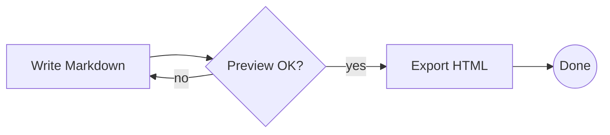

Sequence diagram:

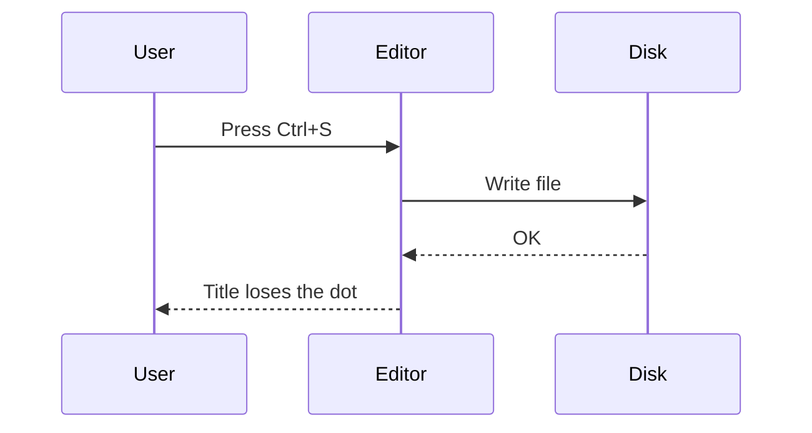

Class diagram:

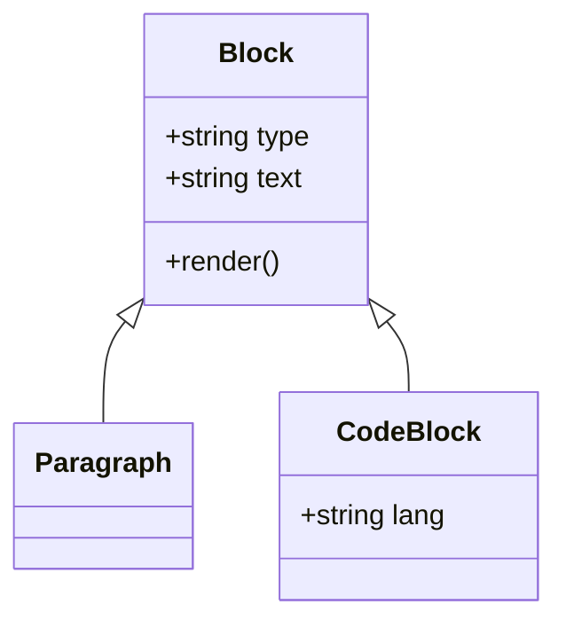

State diagram:

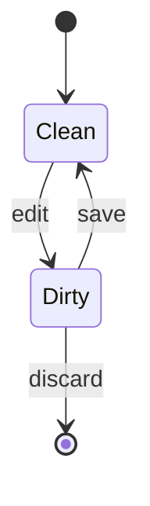

Gantt chart:

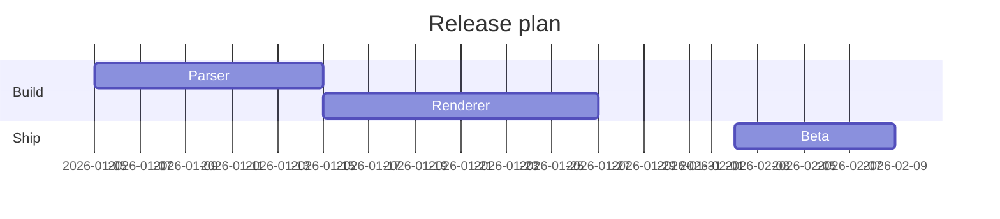

Pie chart:

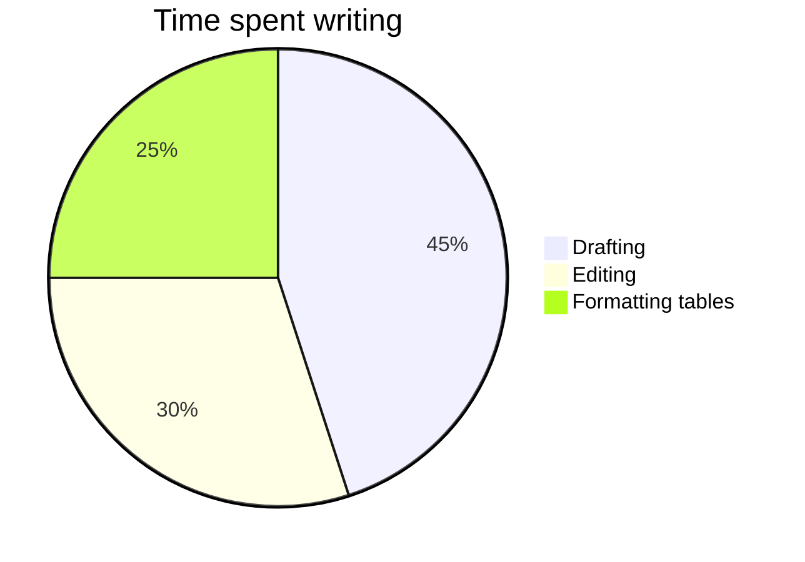

Entity relationship diagram:

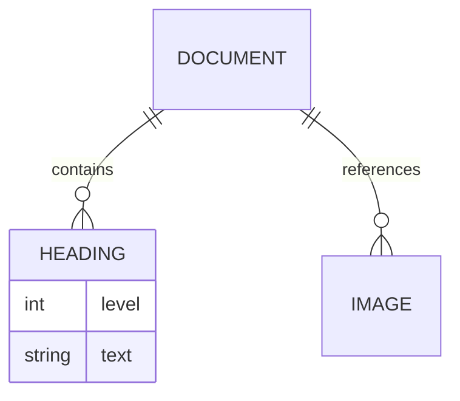

Mind map:

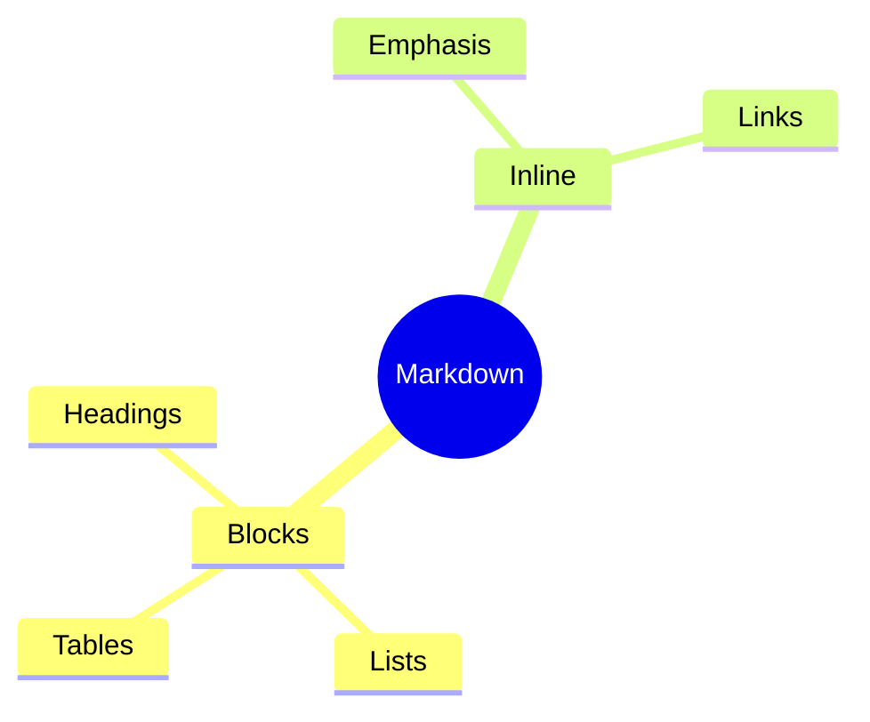

Timeline:

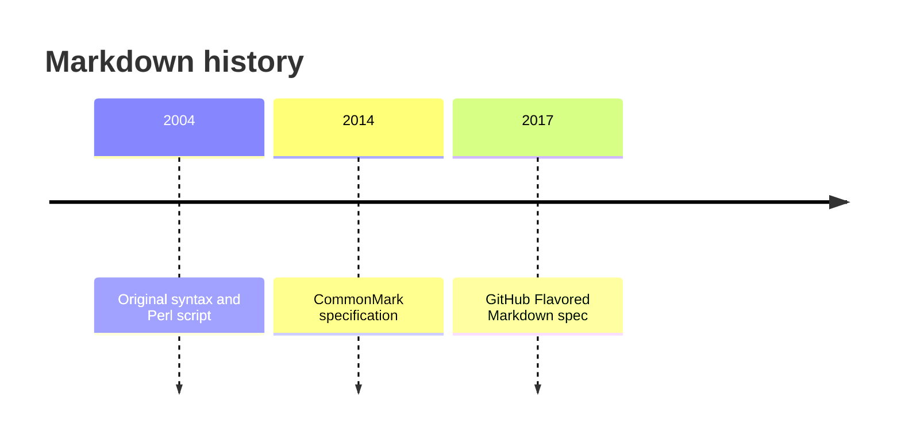

Git graph:

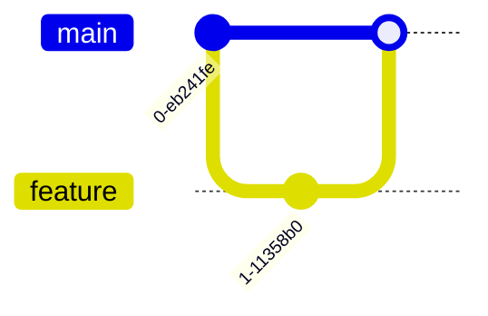

A deliberately broken Mermaid diagram (the editor should show an error for this block only, and nothing else should break):

```mermaid
flowchart TD
    BROKEN-ON-PURPOSE --> {{{ this is not valid mermaid
```

## 16. Other diagrams

*Checks: the non-Mermaid diagram fences this editor renders: `flowchart` (flowchart.js), `sequence` (js-sequence-diagrams), `vega-lite` and `plantuml`. Typora renders the first two as well; GitHub and most others show these as code.*

flowchart.js:

```flowchart
st=>start: Open file
op=>operation: Edit text
cond=>condition: Saved?
e=>end: Close
st->op->cond
cond(yes)->e
cond(no)->op
```

Sequence diagram (js-sequence syntax):

```sequence
Writer->Editor: Type Markdown
Note right of Editor: Parses on each keystroke
Editor-->Writer: Show rendered blocks
Writer->Editor: Save
```

Vega-Lite chart:

```vega-lite
{
  "$schema": "https://vega.github.io/schema/vega-lite/v5.json",
  "description": "Words written per day",
  "data": {"values": [
    {"day": "Mon", "words": 820}, {"day": "Tue", "words": 640},
    {"day": "Wed", "words": 1100}, {"day": "Thu", "words": 450},
    {"day": "Fri", "words": 970}
  ]},
  "mark": "bar",
  "encoding": {
    "x": {"field": "day", "type": "ordinal", "sort": null},
    "y": {"field": "words", "type": "quantitative"}
  }
}
```

PlantUML (off by default in this editor: rendering sends the source to a PlantUML server, so the block shows a notice until it is switched on in the settings):

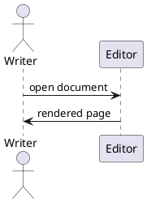

## 17. Raw HTML

*Checks: HTML blocks (div, details/summary, table, comments) and inline tags. GitHub sanitises styles and some tags; Obsidian and VS Code allow most of them.*

<div style="border: 1px solid #4a6fa5; border-radius: 6px; padding: 8px 12px; background: #f4f7fb;">
  <strong>An HTML block.</strong> It has inline styles and is rendered as HTML, not as Markdown.
</div>

<details>
<summary>Click to expand a details block</summary>

Markdown inside details works in some editors when it is separated by blank lines: **bold** and a list:

- one
- two

</details>

<table>
  <thead>
    <tr><th>HTML table</th><th>Value</th></tr>
  </thead>
  <tbody>
    <tr><td>colspan below</td><td>1</td></tr>
    <tr><td colspan="2" align="center">spans both columns</td></tr>
  </tbody>
</table>

<!-- An HTML comment block: invisible in a preview, kept in the file. -->

Inline tags in a paragraph: <kbd>Esc</kbd>, x<sup>2</sup>, log<sub>2</sub>, <mark>marked</mark>, a<br>break, <em>em tag</em>, <strong>strong tag</strong>, <code>code tag</code>, and an inline comment <!-- hidden --> in the middle.

An anchor target: <a id="custom-anchor"></a>and a [link to it](#custom-anchor).

## 18. Escapes and entities

*Checks: backslash escapes and HTML entities, which must render as the literal characters.*

Backslash escapes: \* \_ \# \` \[ \] \( \) \{ \} \< \> \! \| \~ \+ \- \. \\ \$

Escaped markup stays literal: \*not italic\*, \_not italic\_, \~~not struck\~~, \[not a link\](https://example.com), \`not code\`.

Entities: &copy; &reg; &trade; &amp; &lt;tag&gt; &quot;quotes&quot; &nbsp;(non-breaking space) &mdash; &hellip; &#169; &#x1F600; &frac12; &euro;

A backslash before a letter is kept: C:\Users\Public\Documents and \n stay as written.

## 19. 中文段落

*检查：中文排版、全角标点、中英文混排、中文标题的锚点链接，以及中文列表和引用。*

Markdown 是一种轻量级标记语言，它允许人们使用易读易写的纯文本格式编写文档。写作的时候不需要关心排版，标题用井号，列表用短横线，强调用星号，**加粗**、*斜体*、~~删除线~~ 和 `行内代码` 都可以和中文混在一起。

全角标点：“引号”、‘单引号’、《书名号》、【方括号】、（括号）、省略号……破折号——都应当正常显示。中文和 English 之间、中文和数字 123 之间的空格是否保留，取决于原文。

### 中文小标题与锚点

跳转到[本节标题](#中文小标题与锚点)，或者回到[表格](#11-tables)。

1. 第一步：打开文件
2. 第二步：编辑内容
   - 可以插入图片
   - 可以插入公式 $E = mc^2$
3. 第三步：保存

> 引用中的中文：千里之行，始于足下。
>
> —— 《道德经》

一段很长的中文，没有任何手动换行，用来检查编辑器在窗口边缘的自动折行是否正确，以及折行时标点符号会不会出现在行首：春眠不觉晓，处处闻啼鸟。夜来风雨声，花落知多少。床前明月光，疑是地上霜。举头望明月，低头思故乡。白日依山尽，黄河入海流。欲穷千里目，更上一层楼。

## 20. Syntax from other editors

*Checks: syntax that some editors support and this one does not. Each line below is labelled; in this editor they show as plain text or as an ordinary quote, which is the expected result.*

Superscript with carets (not supported here; Typora with the option on, Pandoc): 19^th^ century.

Subscript with single tildes (not supported here; Typora with the option on, Pandoc): H~2~O.

Single-tilde strikethrough (GitHub renders it; not supported here): ~single tilde~.

Wiki links (Obsidian; not supported here): [[Another Note]] and [[Another Note|with an alias]].

Obsidian comments (not supported here): %%a hidden comment%%.

> [!NOTE]
> A GitHub and Obsidian alert. Not supported here: it renders as an ordinary block quote.

Definition list (PHP Markdown Extra, Pandoc; not supported here):

Term
: The definition of the term.

Abbreviation definitions (not supported here):

*[HTML]: HyperText Markup Language

GitLab-style maths fence (only with the GitLab compatibility option, which this editor does not expose; shown as code here):

```math
a^2 + b^2 = c^2
```

## 21. Edge cases

*Checks: structures that often trip parsers and serialisers up.*

An empty ATX heading follows:

#

And an empty level-two heading:

##

A list followed directly by a heading, with no blank line between them:

- first item
- last item
### A heading right after a list

Two code blocks in a row:

```js
const first = 1;
```
```js
const second = 2;
```

A table directly after a paragraph, without a blank line:
| Key | Value |
|-----|-------|
| a   | 1     |

A deeply nested list, six levels:

- level 1
  - level 2
    - level 3
      - level 4
        - level 5
          - level 6

A paragraph directly followed by a fence:
```text
no blank line before this fence
```

#### A heading directly followed by a quote
> quoted right away

Lines with only whitespace follow (spaces, then a tab):
   
	
The paragraph after them; whitespace-only lines count as blank lines.

## 22. Malformed and hostile input

*Checks: how the editor copes with Markdown that is broken, ambiguous or unsafe. Every item is broken on purpose. The editor should show something sensible, keep the text and never run anything. Blocks marked BROKEN-ON-PURPOSE are expected to show an error.*

### 22.1 Unclosed inline markup

Bold that never closes: **this sentence has no closing stars.

Italic that never closes: _this one has no closing underscore.

A link whose parenthesis never closes: [link text](https://example.com/unclosed

An image with no destination: " onclick="document.body.dataset.showcaseOnclick = 'ran'">a javascript: link</a> and a Markdown one: [javascript link](javascript:void(0)).

<iframe src="about:blank" width="200" height="40"></iframe>

### 22.3 Broken tables

A row with too many cells and a row with too few (GFM ignores the surplus cells, so `surplus1` and `surplus2` are not shown):

| A | B |
|---|---|
| 1 | 2 | surplus1 | surplus2 |
| only one |

A delimiter row that does not match the header (so this is not a table):

| A | B | C |
|---|---|
| 1 | 2 | 3 |

A header with no body rows:

| Lonely header | Another |
|---|---|

A table whose delimiter row is broken (so this is a paragraph):

| X | Y |
|-x-|---|
| 1 | 2 |

### 22.4 Broken references and footnotes

A reference to a footnote that does not exist[^missing-footnote], and a link to an undefined reference [nothing here][undefined-ref].

A reference defined twice uses the first definition: [twice][dup-ref].

[dup-ref]: https://example.com/first "First definition wins"
[dup-ref]: https://example.com/second "Second definition is ignored"

A reference definition without a destination is just text:

[no-destination]:

[^unused-footnote]: A footnote that is defined but never referenced.

### 22.5 Broken diagrams and maths

Invalid display maths:

$$
\frac{1}{ % BROKEN-ON-PURPOSE: the brace is never closed
$$

Inline maths with an undefined command: $\undefinedcommand{BROKEN-ON-PURPOSE}$.

Vega-Lite that is not valid JSON (trailing comma):

```vega-lite
{"mark": "bar", "description": "BROKEN-ON-PURPOSE", "data": {"values": []},}
```

flowchart.js with nonsense in it:

```flowchart
this is not => a flowchart (BROKEN-ON-PURPOSE)
```

A js-sequence diagram with nonsense in it:

```sequence
BROKEN-ON-PURPOSE ->-> :::
```

An empty Mermaid block (the editor shows an "empty" notice):

```mermaid
```

A Mermaid block with an unknown diagram type:

```mermaid
notADiagramType
    BROKEN-ON-PURPOSE --> nowhere
```

### 22.6 Ambiguous block structure

Text that looks like front matter in the middle of a document is a rule and a setext heading:

---
title: not front matter
---

A list number with nine digits is still a list, ten digits is not:

123456789. nine digits

1234567890. ten digits is a paragraph

A heading of six hashes with nothing but spaces after it:

######      

Fifteen levels of nested quotes:

> > > > > > > > > > > > > > > deep inside fifteen quotes

### 22.7 Invisible and unusual characters

Zero-width space between these words: zero​width, no-break space: no break, soft hyphen: super­califragilistic, byte order mark in the middle of a line: here, replacement character: �.

Right-to-left override (the text after the control character displays reversed in a browser): abc ‮dcba‬ xyz.

A tab	between	words and a non-breaking space at the end of this line: 

### 22.8 Unclosed blocks at the end

An empty pair of dollar lines and an unclosed display formula follow. This editor needs at least one character between the dollar lines, so the empty pair opens a formula that runs to the next dollar line further down; the sentence between them then ends up inside the formula and shows an error:

$$
$$

If this sentence is shown as part of a formula, the empty pair swallowed it (BROKEN-ON-PURPOSE).

$$
x + y \quad \text{an opening pair of dollars with no closing pair}

A code fence that is never closed runs to the end of the document:

```python
def never_closed():
    return "the fence has no end"

# Everything below this line is inside the unclosed fence.
## Not a heading
- not a list
