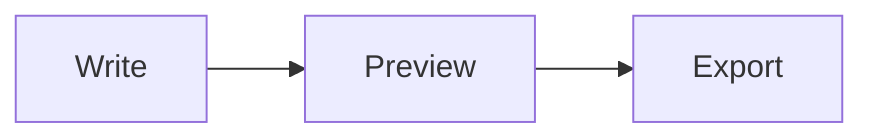

# Writing with Typedown

What you see is what you get: **bold**, *italic*, `inline code` and [links](https://github.com/flintt/Typedown) take shape as you type.

## Project status

| Module | Owner | Status |
| :--- | :---: | ---: |
| Editor | Lin | ✅ Done |
| Themes | Chen | 🚧 In progress |
| Export | Wang | 📝 Planned |

## Diagram



## Math

$$
e^{i\pi} + 1 = 0
$$

## Code

```python
def greet(name: str) -> str:
    return f"Hello, {name}!"
```

## To do

- [x] Tables and task lists
- [x] Math and diagrams
- [ ] Ship the next release

> Focus on the writing; Typedown takes care of the format.
