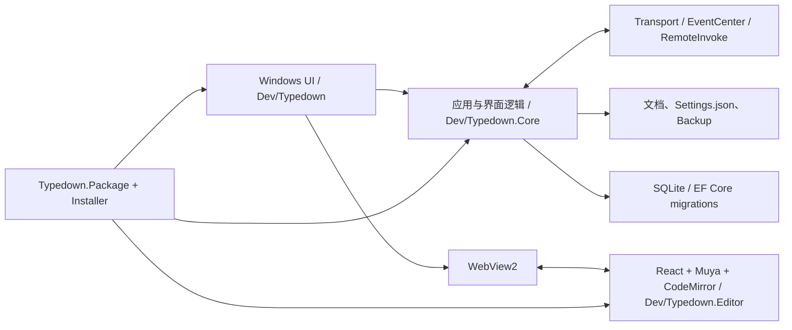

# 当前架构

本文描述仓库当前实现，作为修改边界和代码审阅入口。

## 工程职责

| 目录 | 职责 |
| --- | --- |
| `Dev/Typedown` | Windows 桌面宿主、窗口生命周期、WebView2 初始化、进程和系统集成 |
| `Dev/Typedown.Core` | XAML 控件、ViewModel、文档流程、设置、数据库、服务和通用工具 |
| `Dev/Typedown.Editor` | 浏览器内编辑器，React 外壳、Muya 所见即所得、CodeMirror 源码模式 |
| `Tools/Typedown.Package` | MSIX packaging project 和 manifest |
| `Tools/Installer` | 本地构建脚本与 Inno Setup 安装器 |
| `Tools/EditorBench` | 对构建后编辑器执行浏览器集成和性能检查 |
| `Tests/Typedown.ReliabilityTests` | 可脱离 XAML 构建的持久化、数据库、清单和依赖方向测试 |

`Typedown.Core` 的名称不能理解为纯领域层：它目前包含 UWP/XAML 控件。可执行宿主依赖 Core，Core 不应反向引用 `Dev/Typedown/Typedown.csproj`。可靠性测试守卫这一方向，避免形成项目循环。

## 启动和编辑器

宿主创建窗口和共享服务，`MarkdownEditor` 初始化 WebView2，并加载 `Dev/Typedown/Resources/Statics` 中的前端产物。页面加载完成后通过 remote invoke 获取设置和起始文档。宿主与页面之间只通过 JSON 消息通信，具体契约见 [WebView 消息协议](editor-protocol.md)。

前端正文保存在 ref 中，普通输入不会触发整棵 React 树重渲染。Muya 负责所见即所得和阅读显示，CodeMirror 负责源码模式。宿主用递增的 `loadId` 标记每次文档加载，忽略旧文档迟到的正文、光标和大纲消息。

## 文档状态和持久化

- `EditorViewModel` 保存当前页面上报的正文、选择、滚动、大纲和加载状态。
- `TabsViewModel` 保存各标签的文档快照并协调切换。
- `FileViewModel` 负责打开、保存、另存为、外部变更、导入导出和备份。
- `SafeFile` 在目标同目录写入临时文件，flush 后以替换提交；提交失败时保留完整恢复副本，避免截断原文件。
- `JsonSettingsStore` 在内存保留完整设置对象。快速连续修改合并为最新快照，写入串行执行，并通过 `SafeFile` 原子提交。正常关闭会等待队列排空。
- `AutoBackup` 使用源路径哈希定位备份，并同样使用原子写入。
- `AppDbContext` 使用 SQLite 和 EF Core migrations。迁移在进程内共享一个初始化任务，旧库 fixture 用于验证数据保留和重复执行。

用户文档写入、设置写入和备份写入都不能降级为先截断目标再复制。需要增加新的持久化文件时，应复用可恢复的原子提交方式，并为损坏输入、旧格式和快速连续写入增加测试。

## 运行时边界

应用采用单进程多窗口方式。已有实例通过命名 mutex 和进程间消息接收再次启动的文件请求。WebView2 environment 可共享，但每个窗口的消息订阅和文档身份必须独立释放。

数据库保存最近访问、导出配置和图片上传配置。`Settings.json` 保存界面及编辑偏好；会话、光标和备份是独立恢复材料。修改其中任一格式都要保持向后读取能力，或提供显式迁移。

## 变更规则

- 修改 `Dev/Typedown.Editor` 后必须重建 `Dev/Typedown/Resources/Statics`；打包脚本会拒绝比源码旧的 bundle。
- 新增 WebView 消息时，先定义方向、payload、响应、超时和文档身份，再修改两端并补协议测试。
- 新增语言时同步代码、四个资源文件和 package manifest。
- 修改版本时同步应用项目、程序集、MSIX manifest 和 Inno Setup。
- 修改数据库模型时生成 migration，保留旧库 fixture；禁止用 `EnsureCreated` 代替升级。
- Core 不能引用桌面宿主。需要 Windows API 的实现留在宿主，通过现有接口注入 Core。
- 发布候选必须执行 [Windows 真机验证](windows-verification.md)。
