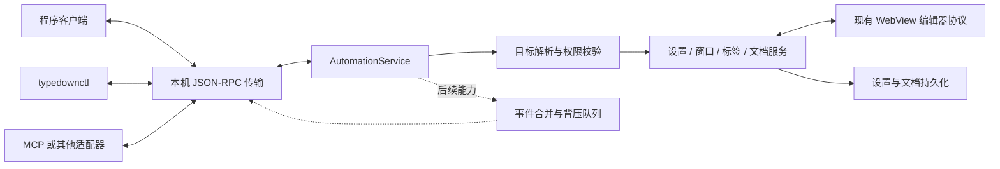

# Typedown 外部自动化接口：分析与实施计划

**文档状态**：方案复审稿 v5（已处理第三轮审阅）
**编写日期**：2026-09-29
**适用范围**：Windows Typedown 与 Typedown Uno
**结论**：建议建设，但先交付 Windows 文档 MVP，服务两个已经存在的调用方：可靠性端到端测试，以及由人观察的 AI 辅助编辑。接口默认关闭，只允许当前系统用户连接。文档线先完成源文本映射稳定性、首次可视编辑语义基线、稳定身份、revision、可控竞态测试和最小读写接口；设置多写入者作为独立修复线并行推进，不阻塞文档 MVP。随后增加观察体验、MCP、设置接口、事件订阅与 Uno 对齐。

相关文档：[v1 协议规格](automation-api-spec.md)、[审阅处理记录](automation-api-review-decisions.md)、[原始审阅](automation-api-review.md)、[当前架构](architecture.md)、[WebView 消息协议](editor-protocol.md)。

## 1. 背景与需求

希望外部程序能够对正在运行的 Typedown 执行三类操作：

1. **设置**：读取和修改主题、编辑模式、字体、自动保存等运行时设置。
2. **编辑**：打开文件、获取未保存正文、替换正文、在选区插入内容、保存、撤销和重做。
3. **观察**：获知窗口、标签、活动文档、正文版本、保存状态、选区、光标和设置变化。

这些能力最终可以服务于命令行脚本、桌面自动化、AI 助手、自动化测试和后续插件生态。第一批调用方已经收敛为：

| 第一调用方 | 立即需要的能力 | 暂时不需要的能力 |
| --- | --- | --- |
| Windows 可靠性端到端测试 | `open/create → get → replaceText/replace → focus → save → 读回磁盘`，并用测试 barrier 确定性制造标签切换和刷新竞态 | 高频事件流、设置接口、跨平台同时上线 |
| AI 辅助编辑，由人观察 | 读取未保存正文、按精确旧文本替换、冲突检测、一次撤销、可选 reveal、连接和写入来源提示 | UTF 偏移批量编辑、远程网关、进程内插件 |

因此 MVP 先做 Windows。它直接补上 R01～R04 行为测试所缺的驱动入口；相同核心接口也能被 CLI 和 MCP sidecar 使用。Uno 在 Windows 契约和行为测试稳定后对齐，减少两端同时试错。

| 使用场景 | 现有能力是否足够 | 原因 |
| --- | --- | --- |
| 从外部打开一个 Markdown 文件 | 基本足够 | Windows 和 Uno 已能把再次启动时的文件参数交给运行实例 |
| 监控磁盘上的 Markdown 文件 | 足够 | 外部程序可直接使用文件系统监控 |
| 修改磁盘文件并让 Typedown 重载 | 部分足够 | 会遇到未保存内容、自动重载和确认对话框冲突 |
| 获取正在编辑但尚未保存的正文 | 不足 | 最新正文可能仍在 WebView 内，磁盘和宿主快照都可能不是最新状态 |
| 修改当前选区或在光标位置插入内容 | 不足 | 选区和光标只存在于当前编辑器会话中 |
| 修改设置并立即作用于运行中的窗口 | 不足 | 直接写 `Settings.json` 不会可靠更新内存模型，还可能被应用的下一次保存覆盖 |
| 观察活动标签、保存状态和正文变化 | 不足 | 文件系统无法表达应用内标签、未保存状态和光标状态 |
| 供 AI 工具进行可检查、可撤销的编辑 | 不足 | 需要文档身份、版本检查、编辑事务和结构化错误 |

因此，只为“打开文件”没有必要扩展接口；如果目标包含实时设置、编辑和观察，则有必要建立正式的自动化边界。

## 2. 当前代码基础

### 2.1 Windows 版

- `App` 使用 mutex 保持单进程，并使用 `Typedown.App.PiPe` 命名管道接收第二次启动的命令行参数。
- 当前命令行解析只寻找第一个可编辑文本文件，没有通用命令、响应模型和事件流。
- 宿主与 WebView 编辑器之间已有 JSON 消息协议，包含调用、普通事件和差分事件。
- `EditorViewModel` 已维护正文、选择、光标、大纲、保存状态与 `loadId`，并能通过 `FlushContentAsync` 请求 WebView 立即上报最新正文。
- `TabsViewModel` 保存各标签的正文快照、历史和保存状态，但 Windows 版文档尚无面向外部协议的稳定 `documentId`。
- `SettingsViewModel` 通过 `JsonSettingsStore` 保存设置；快速修改会合并成串行、原子写入。

### 2.2 Uno 版

- `SingleInstance` 已使用 Unix Domain Socket 接收第二次启动的文件列表。
- `EditorTransport` 实现了与 Windows 编辑器协议相同的调用和事件模型。
- `DocumentViewModel` 已有稳定的 `DocumentId`、正文刷新、保存锁、文件监控和原子保存。
- `AppSettings` 集中保存设置并发布 `PropertyChanged`。

### 2.3 可以复用与不能直接暴露的部分

可以复用：

- 文档打开、保存、撤销、重做及标签切换的现有业务方法。
- WebView 的 `FlushContent`、`LoadFile`、`SetMarkdown` 和编辑器事件。
- 设置模型的类型、默认值、变更通知和持久化队列。
- Windows 命名管道和 Uno Unix Domain Socket 的平台经验。

不能直接对外暴露：

- **现有单实例通道**：它们只为文件转交设计，消息没有版本、方法、错误、取消和并发语义。
- **WebView 内部协议**：它信任随应用发布的页面，包含内部 UI 命令和松散的 `JToken`/`JsonNode`，没有外部调用所需的授权、稳定性承诺和参数校验。
- **设置文件**：运行时内存模型是写入者，外部直接改文件会形成双写竞争。
- **宿主 ViewModel 实例**：多窗口、多标签下必须先确定目标；“当前文档”不能作为所有调用的隐式目标。

## 3. 目标与非目标

### 3.1 Windows 文档 MVP 目标

- 为当前系统用户提供稳定、版本化的本机请求/响应接口。
- 能明确列出窗口和文档，并通过稳定标识选择目标。
- 能创建未命名文档、打开文件，并一致地读取最新未保存正文及可选标题列表。
- 能按全文或精确旧文本修改正文，强制检查 `baseRevision`，一次调用形成一个撤销步骤。
- 变更在当前编辑器实际应用后才成功返回；`save: true` 还必须等待磁盘持久化。
- 调用方显式要求 `reveal` 时切换到目标文档；MVP 确认编辑器已经应用，后续可增加页面可绘制帧的近似回执。
- 自动化客户端连接期间显示常驻标记，外部写入时短暂显示来源。
- 发布机器可读的 JSON Schema、协议 fixture 和官方 CLI；CLI 提供 `--json` 与稳定退出码。
- 用该接口落地 R01～R04 的 Windows 端到端行为测试。

### 3.2 第一版非目标

- 不监听局域网地址，不提供公网 HTTP 服务。
- 不把全部内部 WebView 消息、ViewModel 属性或反射能力暴露给外部。
- 不允许读取密码、令牌等秘密设置。
- 不承诺多个客户端实时协同编辑或 CRDT 合并。
- 不提供插件代码在 Typedown 进程内执行的能力。
- 不把自动化接口同时设计成完整插件系统；插件生命周期和权限模型另行设计。
- 不在调用方没有明确请求时抢占活动窗口、切换标签或移动用户光标。
- MVP 不提供事件订阅、事件背压、批量偏移编辑或跨重连幂等结果缓存。
- 设置接口不属于文档 MVP；Windows 设置单一写入者修复独立推进，完成后再开放设置方法。
- MVP 不要求 Windows 与 Uno 同时上线；Uno 复用稳定后的 schema 和行为 fixture。

## 4. 推荐架构



建议把接口分为三层：

1. **AutomationService**：平台无关的命令、查询和版本检查。它调用业务层，不处理管道细节；事件模型在有实际调用方后追加。
2. **平台传输层**：Windows 使用命名管道，Uno 使用 Unix Domain Socket；负责当前用户权限、连接、帧、取消和断开清理。
3. **客户端与适配层**：程序可以直接连接；`typedownctl`、MCP server 等也调用同一套接口，应用本身不为每种工具复制业务逻辑。

现有单实例端点继续只处理再次启动和文件转交。自动化接口使用独立端点，避免协议升级、长连接订阅或异常客户端影响正常启动。

建议端点名称：

- Windows：`Typedown.Automation.v1.<UserSid>`
- Uno：`$XDG_RUNTIME_DIR/typedown-automation-v1.sock`

## 5. 协议与一致性决策摘要

完整消息结构、方法、错误码、scope 和资源限制见 [v1 协议规格](automation-api-spec.md)。实施计划依赖以下已经冻结的边界：

- 本机 IPC 使用 JSON-RPC 2.0 和 `Content-Length` framing；Windows 使用当前用户可访问的命名管道，Uno 使用权限为 `0600` 的 Unix Domain Socket。
- `system.initialize` 协商 API 版本、能力、`requestedScopes`、持久的自报 `client.id` 和服务端 `clientSessionId`。自报 ID 只用于关联，不能作为授权凭据。
- 连接层从 v1 起支持双向请求路由，但 Windows 文档 MVP 不发送服务端主动请求。
- 每次写入都携带 `documentId` 和 `baseRevision`，并在页面应用前再次比对 `baseContentHash`。同一文档的修改串行，不使用隐式“当前文档”写语义。
- MVP 提供全文替换和固定字符串 `replaceText`；偏移编辑、完整事件流和跨连接幂等结果缓存延后。
- 普通写成功表示权威内存状态与活动编辑器已应用同一 revision；`save: true` 还表示该 revision 已持久化。呈现只作为显式请求的近似观察结果。
- 接口默认关闭，按当前系统用户隔离；连接提示常驻，日志不记录正文或秘密设置。

## 6. 实时显示缺口与源文本边界

| 能力 | 当前表现 | 缺口 |
| --- | --- | --- |
| Windows 设置 → 当前窗口 XAML | 大部分属性经 `PropertyChanged` 和绑定立即变化 | 自动化必须在 UI 线程调用真实属性或语义方法；没有统一呈现回执 |
| Windows 设置 → 多窗口 | 每个窗口有独立 scope、独立 `SettingsViewModel` 和独立 `JsonSettingsStore` | 一次修改不会可靠广播到其他窗口；多个内存快照还可能互相覆盖设置文件 |
| Uno 设置 → 多窗口 | `AppSettings.Current` 是共享实例，各页面监听变化 | 已接近要求，但编辑器设置仍只有单向消息，没有应用回执 |
| 编辑器相关设置 | Windows 通过 `notifySet` 发 `SettingsChanged`；主题、语言另有专门路径 | 白名单不等于完整的可见性定义；不同设置需要不同 apply handler 和回执 |
| 活动文档全文替换 | `SetMarkdown` 会增加 React `contentVersion`，Muya/CodeMirror 随后更新 | 消息不带 operation ID；编辑器应用完成后没有回执；接口会过早返回 |
| Markdown 源文本稳定性 | `7c02d10` 以原始源文本映射 Muya 的初始规范化输出；当前 `reading-source-check.js` 已通过 | 证明了无真实编辑时的映射稳定性，但不能证明第一次可视编辑后的完整序列化保真；外部写入还未公开待规范化风险 |
| 后台标签正文替换 | 可以修改标签快照 | 人不会立即看到正文；需要更新脏标记，并由显式 `reveal` 决定是否切换标签 |
| 标题、脏标记、撤销栈 | 用户输入路径能够更新 | 外部写入尚无统一事务，不能保证一次修改对应一个撤销步骤和同步标题 |
| 大纲、字数、光标 | 编辑器在正常内容变化时上报 | `SetMarkdown` 先更新容器的源文本；Muya 初始规范化输出会被映射回原文，同文不再上报。若后续输出不同仍可能产生 `MarkdownChange`；目前没有 change origin，也没有保证派生状态属于目标 revision 的完成协议 |
| 外部观察 | 只有进程内 `EventCenter`/`PropertyChanged` | 没有线程安全的外部事件汇聚、顺序号、快照水位、背压和重连语义 |

为了满足“通过接口修改后，人能实时观察”，还需要补齐以下能力：

1. **Windows 全局设置状态**：把持久化状态从每窗口 `SettingsViewModel` 中拆出为单一的应用级 store；每窗口保留 UI/编辑器 apply façade。全局设置广播到所有窗口，窗口设置必须由 `windowId` 定位。
2. **设置 scope 清单**：为每项设置标注 `application`、`window`、`workspace` 或 `document`。当前同一设置类混合了应用偏好和窗口布局，不能直接整体公开。
3. **语义化设置处理器**：主题必须走 `ApplyBuiltInTheme/ApplyCustomTheme` 的互斥逻辑，阅读/源码模式要保持约束，语言和快捷键要执行各自刷新流程，不能用反射直接赋值。
4. **编辑器应用回执**：新增宿主到页面的 `ApplyDocumentEdit` 和页面到宿主的 `DocumentEditApplied`，携带 `operationId`、`loadId`、目标 revision、实际正文 hash 和可选呈现结果。
5. **编辑器端二次冲突检查**：`ApplyDocumentEdit` 携带 `baseContentHash`；页面在应用前刷新自身实时正文并比较，堵住宿主检查后用户继续输入的竞态。
6. **精确源文本、来源与规范化信息**：宿主持有权威源文本；页面区分宿主应用、真实用户输入和内部重渲染。没有用户编辑时，外部写入后 `get`、模式切换和保存必须逐字一致；写结果同时公开 `source` 与 Muya 初始序列化结果的关系。
7. **编辑器设置回执**：新增 `ApplySettings`/`SettingsApplied`。React 更新 options、Muya/CodeMirror 应用设置后再确认；只有请求 `awaitPresentation` 时才额外等待帧。
8. **宿主呈现近似回执**：XAML 属性变化后等待 UI dispatcher 和一次呈现机会；结果明确是近似观察状态，不进入文档提交语义。
9. **外部编辑事务**：为历史栈增加明确的外部编辑记录方法，保存修改前后的正文和光标，确保一次 API 操作可一次撤销。
10. **派生状态屏障**：外部编辑完成时同步大纲、字数、选区、标题和保存标记；回执应说明这些状态属于哪个 revision。
11. **稳定窗口/文档注册表**：Windows 和 Uno 都需要能在线程安全地枚举、定位和清理窗口、标签及 dispatcher，不能依赖“最后活动窗口”。
12. **连接和写入提示**：至少一个客户端连接时，状态栏常驻“自动化已连接”；外部写入时短暂显示调用方名称和目标文档，不弹出打断输入的对话框。
13. **观察体验**：`replaceText` 优先按局部范围应用并保留滚动和选区；显式全文替换先保证正确性，后续再优化单差分应用和变化区域高亮。

### 6.1 可视模式第一次编辑后的规范化边界

精确保留源文本有明确边界。Muya 当前只在导出的 Markdown 仍等于导入时的 `imported.normalized` 时，用 `imported.source` 替换回原始拼写。用户在可视模式第一次真实编辑后，导出通常不再等于该规范化基线，宿主会收到 Muya 对完整文档的序列化结果。列表标记、表格对齐、空行等可能在同一个 revision 中发生全文格式变化，即使人只改了一个字。

这是当前编辑器的既有行为，自动化接口不能把它隐藏成局部变化：

- 活动编辑器外部写入时立即比较 `source` 与 `normalized`。成功结果和后续读取持续返回 `pendingNormalization: none | knownFormatting | unknown | unsafe`、源 hash、可空的规范化 hash、原因和分类器版本，让调用方在人第一次可视编辑前知道是否存在全文重排边界。
- 后台标签没有 Muya 实例，不能声称写入时已经取得 `normalized`。默认 `requireKnownSafe` 因 `unknown/notEvaluated` 拒绝提交；调用方只有显式选择 `allowUnknown` 才能写入。第一次可视加载必须在启用输入前完成分类；若确认 `unsafe`，保留权威源文本并阻止可视编辑，源码模式仍可用于修复。
- `none` 只表示逐字相同；`knownFormatting` 只用于有明确差异白名单、受保护载荷检查和固定 fixture 证明的转换；其余非相同结果归入 `unknown`。初版全部保守落入 `unknown` 也比误报安全更可靠。
- 已确认丢失内容或结构时返回 `content_not_roundtrippable`。宿主丢弃候选状态，并用写入前权威正文、光标和滚动通过 `LoadFile` 重新载入；只有该恢复加载也失败才进入 `editor_inconsistent`。
- 同一个 Markdown 解析器的 DOM 或纯文本等价不能单独证明安全，因为它可能重复同一解析缺陷，并遗漏 URL、代码围栏语言、HTML 属性、任务状态、front matter 等不可见语义。它只能作为分类器的辅助证据。
- 正文写方法默认使用 `normalizationPolicy=requireKnownSafe`，只接受 `none`/`knownFormatting`；`unknown` 返回 `normalization_unclassified` 且不提交。机器调用方审查风险后可显式使用 `allowUnknown`，但界面在第一次可视编辑前仍给出非阻塞提示；`unsafe` 永远拒绝。
- 该次用户编辑以实际完整文本递增 revision，`document.get` 和 `contentHash` 返回序列化后的精确结果。
- `document.changed` 若以后提供范围，在无法证明只有局部变化时必须标记 `changeRangeKnown: false`，不能伪报只改了按键位置。
- AI 或 MCP 收到 `revision_conflict`、`match_count_mismatch` 后必须重新读取 latest 正文。`replaceText.find` 应选取尽量短且唯一的内容片段，避免依赖无关的列表标记、表格填充空格或空行拼写。
- 行为测试执行“接口写入 → 一次真实可视模式输入 → latest 读取”，保存实际输出基线，并验证用户修改、标题/列表/代码块等 fixture 语义仍在；不能断言全文只变化一个字符。

长期改善方向是保存块级源片段，只重新序列化实际编辑的块。它属于 Muya 文本保真工程，不阻塞自动化 MVP，但决定人和代理长期共同编辑时的差异质量。


## 7. 性能与可靠性要求

1. **查询不能阻塞 UI**：列表和元数据从线程安全快照读取；只有必须接触当前 WebView 的操作切到 UI 线程。
2. **正文只按需传输**：列表、事件和状态查询不携带全文。
3. **修改按文档串行**：不同文档可以并行，同一文档不能并行写。
4. **刷新有界且失败安全**：刷新超时不执行覆盖性写入。
5. **保存仍使用原子写入**：接口不能绕过 `SafeFile`、编码/换行保存和备份策略。
6. **设置写入有终态**：独立设置接口成功前等待设置队列排空，并报告 `LastWriteError`；这不阻塞文档 MVP。
7. **应用有回执**：活动 WebView 通过 operation 回执确认正文和 hash；可选呈现结果另行报告，不能代替应用确认。
8. **局部编辑逐步优化**：MVP 先保证 `replaceText` 的文本语义和精确回执；阶段 2 再把匹配范围映射为局部页面修改并保留选区和滚动。全文替换的局部差分应用只在证明语义等价后加入。
9. **事件有背压**：后续事件功能的慢客户端不能拖慢编辑器输入、UI 调度器或其他客户端。现有 `EventCenter` 只用于 UI 线程内消息，不直接承担并发外部订阅。
10. **生命周期可恢复**：WebView 重载、标签关闭、窗口退出和应用更新时，待处理请求得到明确错误或连接关闭，不永久等待。
11. **调用可诊断**：超过 200 ms 的调用按阶段记录耗时，但不记录正文。

## 8. 代码组织建议

### 8.1 Windows 仓库

建议新增：

```text
Dev/Typedown.Core/Automation/
  AutomationService.cs
  AutomationContracts.cs
  AutomationErrors.cs
  AutomationMethodRegistry.cs
  AutomationObjectRegistry.cs
  DocumentOperationCoordinator.cs

Dev/Typedown.Core/Services/
  ApplicationSettingsStore.cs
  SettingsApplyRegistry.cs

Dev/Typedown/Services/Automation/
  NamedPipeAutomationServer.cs
  JsonRpcConnection.cs
  ContentLengthFraming.cs
  PipeSecurityFactory.cs

Tools/Typedown.Cli/
  Program.cs
  AutomationClient.cs

Tests/Typedown.Automation.TestHost/
  Typedown.Automation.TestHost.csproj
  AutomationTestBarriers.cs

Tools/AutomationE2E/
  run-windows-e2e.ps1
  invoke-hp-interactive.ps1
```

Core 层负责方法语义、对象身份和文档操作协调，桌面宿主负责 Windows IPC、窗口激活和可选呈现回执。`JsonRpcConnection` 必须为两个方向分别管理请求。`ApplicationSettingsStore` 与 `SettingsApplyRegistry` 属于独立设置线；文档方法注册和测试不能依赖它们。设置线完成后，每窗口 `SettingsViewModel` 变成共享设置的 façade，不再各自拥有设置文件快照。不要让 Core 反向引用桌面宿主。`AutomationEventHub` 只在阶段 3 确认需要事件时新增。

竞态 barrier 放在独立测试宿主/程序集，不进入正式 `Typedown` 项目引用图。测试宿主使用独立应用标识、互斥体、IPC 端点和数据根目录；它可以复用生产 Core，但其窗口标题与版本标签必须包含 `AUTOMATION TEST HOST`。现有 `Tools/Installer/build-local.ps1` 允许 `Debug` 后继续打 Inno 安装包，因此不能把 Debug 等同于测试宿主；实施时应针对测试宿主项目、测试程序集或 `buildType=automationTestHost` 增加硬拒绝，只允许不进入发布目录的散装输出。CI 的 MSIX、Inno 和 portable zip 步骤采用同样的发布内容检查。

### 8.2 Uno 仓库

建议与 Windows 保持相同 contracts 和 JSON fixture：

```text
Typedown.Uno/Automation/
  AutomationService.cs
  AutomationContracts.cs
  AutomationObjectRegistry.cs
  DocumentOperationCoordinator.cs
  UnixSocketAutomationServer.cs
  JsonRpcConnection.cs
```

两个仓库目前不能直接共享程序集，因此协议文档、示例消息和 contract fixture 是一致性的基线。后续若建立共享包，再迁移公共 contracts 和 framing；第一版不应为了共享代码先重构整个工程。

## 9. 分阶段实施计划

阶段 0 分成两条可并行工作线。阶段 1 的文档 MVP 只依赖 0a；0b 的设置可靠性修复继续推进，但不能卡住 R01～R04 和 AI 编辑闭环。

### 阶段 0a：文档写接口准入基线

目标：证明正文状态能够承受自动化写入，并建立确定性测试条件，不增加 Release 外部监听端点。

任务：

- [x] 把现有 `reading-source-check.js` 纳入固定回归入口；保留审阅所举的列表、紧邻标题和 fenced bash 文档，并把测试名称与断言说明改为“源文本映射稳定性”。*（`Tools/EditorBench` 的 `npm run check:source`。）*
- [x] 扩充无用户编辑时的稳定性 fixture：GFM 表格、HTML、脚注、公式、Mermaid、emoji、组合字符、CRLF、无末尾换行、大文档和已记录的 CommonMark 边界样例。*（`source-stability-check.js`，90 个样例，`--full` 全部 652 个 CommonMark 例子。CRLF 改为宿主契约：正文只用 `\n`，见规格。）*
- [x] 增加“接口候选写入 → 可视/阅读/源码模式往返 → flush/get/save”的测试；没有真实编辑时逐字节相同、不推进 revision、不标脏。该测试不能被描述为首次编辑后的保真证明。*（E2E M01：接口写入 Muya 会改写的正文（setext、`*` 列表、不齐表格），阅读/源码/可视来回切换 5 次，每次逐字读回、revision 与未保存状态不变，保存后磁盘字节等于写入正文；hp 通过。）*
- [x] 活动编辑器写入时取得 `source` 与 `importedRef.normalized` 的 hash，定义并返回 `pendingNormalization` 和分类器版本；默认 `requireKnownSafe` 拒绝 `unknown`，显式 `allowUnknown` 才能提交。后台标签在首次可视加载、启用输入前完成分类。不得把同解析器渲染等价当作充分条件。*（页面侧已完成：`services/normalization.ts` 分类器 v2，按原文独立扫描受保护载荷；`window.__typedownPendingNormalization`。待做：宿主经消息取得结果并据此拒绝写入。）**（宿主侧已接上：写入结果和 `document.get` 带 normalization，默认拒绝 unknown；仍缺：后台标签首次可视加载前分类、unsafe 时阻止进入可编辑可视模式。）**（2026-09-30 决定方案 A：修复而非阻断。已修：代码块信息串属性、Tab（词法只展开块前缀里的 Tab）。剩余 unsafe（HTML 块里的实体、多行 HTML 属性里的空行）日常使用显示不阻断的提示条，自动化写入仍按 `content_not_roundtrippable` 拒绝；不再阻止进入可视模式。）*
- [x] 建立独立的受保护载荷 fixture，覆盖链接/图片 URL、代码围栏语言和正文、脚注、任务状态、原始 HTML 属性、front matter、公式及扩展块；已确认内容或结构损坏时返回 `content_not_roundtrippable`。*（`docs/automation-fixtures/protected-payload.json`：13 个 preserve 文档（带逐字 `mustKeep`）、18 个 loss 对、9 个 safe 对。编辑器 jest 要求每个 loss 判 unsafe 且原因正确、safe 不判 unsafe；`protected-payload-check.js` 用真实按键检查，丢失按子串判断、不借用分类器（借用时去掉围栏保护检查仍通过，已改）。新发现并补上：行内公式未受保护（分类器 v3）。现状：Muya 首次编辑会丢围栏信息串属性和围栏正文空白，均已预测为 unsafe；unsafe 到 `content_not_roundtrippable` 的映射由 `DocumentEditTests` 覆盖。）*
- [x] 增加“接口写入 → 一次真实可视输入 → latest 读取”基线，记录 Muya 首次编辑造成的完整序列化结果和实际变化范围，并验证受保护载荷与文档结构仍在。*（页面级已完成：`first-edit-check.js` 以 `LoadFile` 代替接口写入，要求实际结果与预测一致，基线 63 none / 24 unknown / 3 unsafe。接口可用后改走接口。）**（E2E S1 已在真实窗口里用真实按键验证写入后输入与读取；首次编辑序列化基线仍是页面级。）**（2026-09-30 E2E F01：经接口写入带受保护载荷的文档，在真实窗口里真实按下一个键，latest 读取与保存后逐项检查每个受保护载荷仍在；hp 11/11 通过。逐 fixture 的序列化基线仍由页面级 `first-edit-check.js` 记录。）*
- [x] 给页面变化报告增加来源或等价判定，确保内部重渲染和初始规范化不能伪装成用户编辑。*（`MarkdownChange.origin` = `user`/`editor`，`services/changeOrigin.ts`；`Tools/EditorBench/origin-check.js`。宿主尚未使用该字段。）*
- [x] Windows `DocumentTab` 增加稳定 `documentId` 和只在真实正文变化时递增的 revision；协议 fixture 记录 Uno 后续必须复现的语义。*（`DocumentTab.DocumentId/Revision`；语义见 `docs/automation-fixtures/document-identity.json`。）*
- [x] 建立 Windows 线程安全的窗口/文档注册表和 dispatcher 定位方式。*（平台无关部分在 `Dev/Typedown.Automation`（netstandard2.0，`WindowRegistry`、错误码），测试 `dotnet test Dev/Typedown.Automation.Tests` 在 Linux 运行；Windows 适配 `Typedown.Core/Services/AutomationWindows.cs`，窗口加载后注册、关闭时注销。）*
- [x] 定义 `ApplyDocumentEdit` 的暂存、成功提交和宿主恢复状态机；失败统一用写入前权威正文、光标和滚动经 `LoadFile` 恢复，撤销历史只能在页面确认后提交。*（`Dev/Typedown.Automation/DocumentEdit.cs` 的 `DocumentEditCoordinator`，宿主实现 `IEditableDocument`；17 个测试覆盖成功、revision 冲突、刷新超时、页面检测到输入冲突、unknown/unsafe、页面失败/超时/文本不符后恢复、恢复失败隔离、后台文档、无变化、保存失败和同文档并发。待做：Windows 端 `IEditableDocument` 与页面 `ApplyDocumentEdit` 消息。）*
- [x] 为独立测试宿主设计一次性 barrier：至少能停在 `beforeFlushReply`、`afterEditorMutationBeforeReport` 和 `beforeSaveCommit`，并提供等待已命中和释放操作。*（协调器只有中性接口 `IEditBarriers`；`Dev/Typedown.Automation.TestHost` 的 `EditBarriers` 提供 `test.barrier.arm/waitHit/release`，一次性、可限定文档、最长保持 60 秒。）*
- [x] 建立独立测试宿主/程序集；正式应用项目不得引用它。测试宿主使用 `AUTOMATION TEST HOST` 标签、`buildType=automationTestHost`、独立数据目录/IPC/互斥体；正式应用返回 `buildType=application`，其 schema、方法表、能力响应和二进制均不包含 `test.*`。*（部分完成：程序集已独立；应用方法表拒绝注册 `test.*`；`BuildSeparationTests` 检查没有应用项目引用它；`Tools/Installer/assert-application-build.ps1` 在本地和 CI 打包前拒收含测试宿主的目录，已在 hp 验证。待做：测试宿主 exe 变体、标签、独立数据目录/IPC/互斥体，随阶段 1 的管道服务一起做。）**（已完成：`build-local.ps1 -AutomationTestHost` 构建到 `bin\AutomationTestHost`，带标记文件；`--automation-test-root` 隔离数据/日志/WebView2，互斥体、交接管道和自动化端点都按数据根命名；`buildType=automationTestHost`，标题前缀 AUTOMATION TEST HOST。关于页版本标签尚未加标识。）*
- [x] 编写文档 MVP 的 JSON Schema、错误 fixture、scope、稳定客户端 ID、双向请求路由和 `Content-Length` framing 测试。*（`docs/automation-schema/`；`Dev/Typedown.Automation`：`MessageFraming`、`JsonRpcConnection`、`AutomationSession`/`MethodTable`、`Params`、`DocumentText`；75 个测试在 Linux 运行。）*

完成标准：无真实编辑时三种模式的源文本映射稳定；每次写入公开待规范化状态；首次可视编辑后的全文序列化和受保护语义有固定基线；失败写入通过唯一的宿主恢复路径还原旧正文、光标、滚动和 history；R01/R03 能用 barrier 确定性命中竞态；稳定身份、revision 和协议 fixture 可供阶段 1 使用。

### 阶段 0b：设置可靠性线（并行，不阻塞文档 MVP）

目标：修复本来就存在的 Windows 设置多写入者问题，为以后开放设置接口建立单一事实来源。

任务：

- [x] 将 Windows 持久化设置抽成应用级单一 store，消除每窗口独立快照。*（`JsonSettingsStore.Shared`：每个设置文件一个进程级 store，带 `Changed(name, origin)` 事件和 `Revision`。）*
- [x] 每窗口保留 UI/编辑器 apply façade，验证多个窗口和已打开设置页同步刷新。*（E2E B01/S2/B02：两窗口互相跟随、窗口级模式不串；两个窗口的编辑器页面实际字号改变；另一窗口已打开的设置页字号框由 UI Automation 读到新值；hp 通过。）*
- [x] 建立外部设置 key 的规范映射数据，覆盖 scope、类型、范围、平台属性、apply handler、可见目标和敏感级别。*（`docs/automation-fixtures/settings-map.json`：首批 4 个 key（主题、字号、行高、文字方向）的类型、范围、Windows/Uno 属性、应用路径、可见目标和敏感级别；其余每个已存储的 Windows 设置都按原因分组列为不开放（窗口级、视图状态、搜索、秘密、内部、路径、代码、需重启、待评审）。`SettingsMapTests` 要求每个设置都有归属，新增设置不登记就失败。）*
- [x] 为快速连续写、持久化失败、窗口关闭和旧窗口覆盖新值建立回归测试。*（`SettingsStoreTests`，Linux 运行：多线程连续写、写失败后恢复、监听者抛异常不影响其他窗口、旧窗口覆盖新值（改回每窗口一个 store 时该测试失败）。窗口关闭时取消订阅在 `SettingsViewModel.Dispose`，待 GUI 验证。）*

完成标准：Windows 多窗口不再有设置多写入者；相同映射数据能够生成 `settings.describe`，但阶段 1 无需等待本阶段完成。

### 阶段 1：Windows 文档 MVP 与可靠性测试驱动器

目标：交付一个可被程序立即使用的文档闭环，并用它建立 Windows 行为测试。

任务：

- [x] 实现独立命名管道服务、当前用户 SID ACL、连接上限和默认关闭开关。*（`SecurePipeListener`：受保护 DACL 只含当前用户 SID、拒绝远程客户端、首实例标志防抢注；`AutomationServer` 连接上限 8；“允许本机自动化”默认关闭，关闭即停止监听并断开全部连接。）*
- [x] `JsonRpcConnection` 同时路由两个方向的请求/响应；MVP 不发送服务端请求，但实现不固化为单向。*（阶段 0a 已完成并有测试。）*
- [x] 实现 `system.initialize/ping`、`app.getState`、`window.list/focus`，返回 scope、`clientSessionId` 和能力。*（`AutomationSession` + `DocumentMethods` + `WindowsAutomationHost`。）*
- [x] 实现 `document.list/get/open/create/focus`，latest 读取必须完成 WebView 刷新。*（latest 读取先等页面确认当前加载再刷新；E2E S0 验证逐字读回。）*
- [x] 实现 `document.replace`、`document.replaceText`、`document.save`、`undo/redo`，强制 `baseRevision`。*（后台标签的 save/undo/redo 本版返回 `editor_not_ready`（reason `notActive`），需先 focus。）*
- [x] 新增 `ApplyDocumentEdit/DocumentEditApplied/DocumentEditRejected`；页面应用前再次检查 `baseContentHash`，成功后返回源文本、初始序列化文本的 hash 与 `pendingNormalization`，失败后由宿主通过 `LoadFile` 完成恢复确认。*（拒绝用 `DocumentEditApplied` 的 `outcome: conflict/failed` 表达，没有单独的 Rejected 消息。）*
- [x] 让一次成功外部修改形成一个撤销步骤；`replaceText` 先保证精确文本结果，页面局部应用留到阶段 2。*（`CommitAutomationText` 先结束读者待定输入再单独成步；E2E R02 验证撤销/重做不串文档。）*
- [x] 只在独立测试宿主注册 `test.*` barrier；正式应用和 Release 测试断言这些方法返回 `method_not_found`、能力中不可见，并检查包内容不存在测试程序集或 `test.*` 符号。*（方法表拒绝应用构建注册 `test.*`；`BuildSeparationTests` 保证只有测试宿主变体引用该程序集；打包脚本拒收含测试宿主程序集或标记文件的目录，并扫描 Typedown 二进制中的 test.* 方法名（UTF-16/UTF-8），已在 hp 两向验证。）*
- [x] 状态栏显示不可由客户端关闭的连接标记，写入时短暂显示客户端名称和目标文档。*（改为窗口标题：状态栏可被用户关闭（hp 上就是关闭的），标题不能；连接时显示“自动化已连接”，写入后 4 秒显示“{客户端} 编辑了 {文档}”，74 种语言。）*
- [x] 实现 `typedownctl` 的 `status/windows/documents/get/open/create/replace/replace-text/save`，所有命令支持 `--json` 和稳定退出码；正文写命令用显式 `--allow-unknown-normalization` 映射协议中的风险接受，不能默认开启。*（Linux 对真实管道服务端测试；在 hp 上通过 SSH 对运行中的测试宿主执行 status/windows/documents/get 正常。）*
- [x] 用 CLI/客户端及 barrier 编写 R01～R04 端到端测试；比对 API 结果、界面 revision 和磁盘/备份字节。*（S0、S1、R01～R04、B01 共 7 个用例在 hp 真实桌面通过并连续重复。过程中发现并修复：写入与文档加载竞争、写入期间读者按键被覆盖、写入的保存带上读者未保存的按键、窗口级设置串窗口、未命名文档共用一个备份（多个时崩溃只剩一个，后台未命名文档不备份）、新窗口启动流程覆盖刚创建的文档、测试宿主实例名用了按进程随机的哈希。）*
- [x] 提供 `Tools/AutomationE2E/run-windows-e2e.ps1` 一键入口，以及从 SSH 侧创建并等待交互式计划任务的包装脚本；按第 10.7 节收集结果并隔离数据。*（`start-interactive.ps1` 从 SSH 注册并触发“仅用户登录时运行”的计划任务、等待 result.json；无人登录时报环境错误。）*
- [x] 修改 `Tools/Installer/build-local.ps1` 和 CI：测试宿主只能构建散装输出，拒绝 Inno/MSIX/portable 打包；正式包在产出后扫描测试程序集、`test.*` 和 `AUTOMATION TEST HOST` 标识。*（`-AutomationTestHost` 只出散装输出；本地与 CI 打包前运行 `assert-application-build.ps1`：拒收测试宿主程序集、标记文件，以及二进制中含 test.* 方法名的构建。AUTOMATION TEST HOST 字样在应用 Core 中也存在（仅测试宿主模式使用），不作为扫描依据。）*

完成标准：过期版本不能覆盖用户输入；失败写入不留下半提交状态；外部写入在人正在看的编辑器中实际出现并可一次撤销；`save` 成功后磁盘字节与目标 revision 一致；R01～R04 能在 HP 登录桌面会话中由一条命令重复运行且无需概率性 sleep；正式安装包通过测试代码缺失检查；接口关闭时没有监听端点。

### 阶段 1S：Windows 设置接口（独立交付）

依赖阶段 0b，不依赖阶段 2：

- [x] 实现 `settings.describe/get/set` 和 `settings.read/settings.write` scope。*（`SettingsMethods` + 嵌入的 `settings-map.json`；`WindowsSettingsHost`；E2E S2 在 hp 通过。）*
- [x] 新增 `ApplySettings/SettingsApplied`，普通成功等待运行时应用与设置持久化。*（没有新增页面消息：宿主经某个窗口的 `SettingsViewModel` 设置（与设置页同一套 setter），各窗口通过共享 store 的变更事件应用，编辑器页面由既有的 `SettingsChanged` 更新；成功前等待 store 落盘，写盘失败返回 `persistence_failed`。）*
- [x] 只开放规范映射表中通过多窗口、WebView 和设置页同步测试的设置。*（开放的 4 个 key 来自映射表；多窗口、编辑器页面和已打开设置页的同步由 E2E S2/B02 覆盖字号，其余 3 个 key 走同一路径，尚未逐个端到端验证。）*
- [x] CLI 增加 `settings` 命令；设置接口失败不能影响文档接口。*（`typedownctl settings describe|get|set`；设置方法独立注册，失败只返回该请求的错误。）*

完成标准：设置修改在全部相关窗口和编辑器中可见并在重启后保留；设置线未完成不影响文档 MVP 发布。

### 阶段 2：观察体验与 AI 入口

目标：让人在旁边监督外部编辑时能看清变化，并让 AI 通过稳定适配层使用文档 MVP。

任务：

- [x] 为 `reveal: "document"` 增加可选 `awaitPresentation`；页面用两次 `requestAnimationFrame`，宿主报告 dispatcher/窗口/标签可见状态。*（Windows 实现见规格 2.4“呈现回执”；超时返回 `presentation_timeout` 并带已提交的 revision。测试：`DocumentMethodsTests`、E2E P01（最小化窗口的后台标签）。）*
- [x] 把 `replaceText` 的匹配范围映射为当前编辑器的局部修改，避免为一个短替换重建全文。*（页面统一处理：`replaceText` 和 `replace` 都把新全文交给页面，页面算最小变化区间。源码模式一次 `replaceRange`；可视模式见下一项。）*
- [x] 优化显式全文替换：计算等价的最小变化区间后局部交给 CodeMirror/Muya；不能证明等价时仍走正确的全文路径。*（Muya `replaceMarkdownLocally`：新全文照常解析，前后未变的顶层块沿用旧块对象和 DOM，只渲染变化的块；读者光标在变化块里、引用定义变了、或拼出的块导出与整篇导入不逐字相同时退回 `setMarkdown`。`apply-edit-check.js`：5 种文档局部应用后与整篇载入的 DOM 逐字相同（读者点过的块除外），未变块 DOM、光标和屏幕位置保留，两种退回情形；新块插错位置时检查失败。3000 段文档局部应用约 340 ms。）*
- [x] 保持观察者滚动、光标和选区；短暂高亮外部改变的范围，并允许用户关闭高亮动画。*（局部应用保留滚动、光标、选区和未变内容；改动的文字（源码模式）或块（可视模式，含退回整篇路径）淡出高亮 2 秒，系统“减少动态效果”时为静态底色。设置“高亮程序所做的更改”（`HighlightAutomationChanges`，默认开，74 种语言），接口不可改（settings-map：security）。已知限制：读者光标就在被改的块里时退回整篇载入，光标回到文首。）*
- [x] 明确三种模式下的写入和模式切换串行行为，增加写入过程中切模式、切标签、重载 WebView 的测试。*（规格 2.4“写入与模式切换、标签切换、页面重载”。E2E W01–W03 在页面已应用、宿主未提交时重载页面、切换模式、切标签。修复一个真实缺陷：页面重载或标签切走又切回后，宿主仍会提交页面已不再显示的正文；去掉修复时 W01、W03 失败。）*
- [x] 实现 MCP sidecar，把列举、读取、按文本替换、全文替换和保存映射为受控工具；`match_count_mismatch` 指引代理重新读取，不自动用旧文本重试。*（`Tools/Typedown.Mcp`（`typedown-mcp`，stdio，无新依赖），用法见其 README。失败结果带原样的接口错误和下一步指引；`McpTests` 断言同一冲突与 `typedownctl --json` 的错误对象逐字相同、不匹配时不重试（加入自动重试时测试失败）。E2E MC01 在 hp 上以独立进程走真实管道：读取、带 reveal 的替换、窗口标题显示代理名、过期 revision 冲突、关闭输入后自行退出。）*
- [x] 提供 PowerShell、Python 或 TypeScript 直接客户端示例。*（`docs/automation-examples`：Python（仅标准库）和 PowerShell 5.1，都演示“读取 → 按读到的 revision 写入 → 冲突时重新读取、重新决定”。`ClientExampleTests` 让 Python 示例经真实管道服务端遇到读者在读写之间打字，要求按新正文替换（冲突后不重新读取时测试失败）；E2E EX01 在 hp 上用两个示例经真实命名管道写入，并核对 Python 算出的默认管道名。）*

完成标准：外部局部修改不导致无关整页跳动；呈现超时不掩盖正文是否已应用；CLI 与 MCP 对同一冲突给出等价结构化原因。

### 阶段 3：按真实需求扩展

以下能力只在调用方提出并能给出验收场景后实现：

- [ ] `events.subscribe/unsubscribe`、原子快照水位、事件合并、有界队列和 `events.resyncRequired`。
- [ ] `document.applyEdits` 与 `positionEncoding` 协商。
- [ ] 跨连接 `clientOperationId` 结果缓存及明确的过期、进程崩溃和查询语义。
- [ ] `settings.update` 批量原子更新和更多设置白名单。
- [ ] 选区编辑、保存为、工作区级状态等扩展方法。
- [ ] 另写插件体系设计，覆盖安装登记、凭据、逐插件授权、声明式界面贡献、同步钩子、生命周期和编辑器扩展隔离；不能直接把自动化方法改名成插件 API。

完成标准由具体调用方定义；不能只因设计中列过这些能力就自动进入实现。

### 阶段 4：Uno 对齐

目标：复用已经由 Windows 端到端测试验证的协议行为，在 Uno 中实现同一文档契约；设置接口只在阶段 1S 已稳定时一起对齐。

任务：

- [x] 实现权限为 `0600` 的独立 Unix Domain Socket。*（`Dev/Typedown.Automation/Unix/UnixSocketListener.cs`：`$XDG_RUNTIME_DIR/typedown/automation.v1.sock`，没有运行目录或路径超长时用 `/tmp/typedown-<uid>`（只有属主可进时才用）；socket 0600，Linux 上核对对端 uid；崩溃残留的 socket 被替换，仍在应答的不动；超长路径给出清楚的错误。`UnixSocketListenerTests`（去掉 chmod 或目录检查时失败）。typedownctl 和 typedown-mcp 在 Linux/macOS 上连它。）*
- [x] 复用 Windows schema、错误 fixture、CLI 和文档行为测试。*（`Tools/AutomationE2E/equivalence`：同一段 29 步对话（打开、读取、替换、各类冲突与错误、规范化判定、撤销重做、保存、新建、呈现回执），E2E EQ01 录下 Windows 的回答存为 `docs/automation-fixtures/equivalence-windows.json`，Uno 在 Linux 上逐步等价，每条回答通过 v1 schema；只规范化 id、构建类型、未命名文档的本地化标题和平台默认换行。typedownctl、typedown-mcp、Python 示例都在 Uno 上跑过。不含：依赖测试宿主屏障的竞态用例（R01/R03/W01–W03），Uno 尚无测试宿主。另记一次未能复现的偶发：撤销后正文被迟到的页面上报改回（10 次重跑未再现）。）*
- [ ] 映射 Uno 已有 `DocumentId`、共享 `AppSettings.Current`、标签和正文刷新逻辑。*（文档部分已完成（Typedown-Uno `automation` 分支 e45ebe3）：协议库由 `Tools/sync-automation.sh` 同步；`DocumentViewModel` 增加 revision、写入期间暂存读者上报、`ApplyDocumentEdit`、保留历史的恢复加载和提交（含后台标签）；复用空白/预览标签打开文件时换新 documentId，符合身份 fixture；设置开关、标题标记、改动高亮。在 Linux（Xvfb + xfwm4）上用 typedownctl 和 typedown-mcp 实测：逐字读取、带保存的 replaceText、过期 revision 冲突、新建文档写入、带 reveal 的 MCP 写入在页面显示并高亮、标题标记。待做：`settings.*` 映射到 `AppSettings.Current`。）*
- [x] 验证 Linux 路径、换行、大小写、符号链接、socket 崩溃残留和 WebKitGTK 大文档行为。*（`Tools/AutomationE2E/linux/linux_checks.py`，对运行中的 Uno（Xvfb + xfwm4）：a.md 与 A.md 是两个文档、符号链接与目标是同一文档、CRLF 文件以 `\n` 读出并以 CRLF 写回、带空格和中文的路径、1.2 MB 文档精确读回和末尾写入。发现并修复 Uno 的两个缺陷（main 同样存在，Typedown-Uno 5242e7c）：路径按不区分大小写比较且不解析链接；大文件在已运行的可视编辑器里打开时页面先按可视模式排版而卡住数分钟（修复后 11 s）；换回旧比较时三项检查失败。`kill -9` 后残留 socket、CLI 退出码 3，重启 4 s 后替换并应答。）*
- [ ] 在 NUC 执行 CLI、MCP、断线、应用退出、模式切换和大文档测试。

完成标准：Windows 与 Uno 对相同 fixture、版本冲突和文本匹配冲突给出等价响应；已实现的设置方法也必须等价；平台差异只通过 `capabilities` 表达。

### 阶段 5：发布稳定化

- [ ] 冻结 v1 兼容政策和弃用流程。
- [ ] 把接口状态、版本、scope 的实际安全边界、连接指示和 CLI 示例加入用户文档与 release notes。
- [ ] 在 Windows 真机和 NUC Uno 环境各完成一次直接客户端、CLI 和 MCP 的发布候选验证。
- [ ] 只有出现明确远程场景时才设计带认证的网络网关；本机接口不能直接改成 TCP 服务。

## 10. 测试计划

### 10.1 协议与传输

- 半包、粘包、连续多帧、零长度、错误 header、超长 header、截断 body。
- 非 UTF-8、无效 JSON、重复请求 ID、未知方法、未知可选字段、未初始化调用。
- 客户端断开时，尚未开始的排队操作不产生修改；已提交操作由客户端重连后读回实际 revision，不能谎报为未执行。
- 客户端在请求中断开、服务端在响应中退出时，重连后重新初始化并读取状态；CLI 不自动重试 `document.create`。
- Windows ACL 和 Uno `0600` 权限检查。
- 客户端和服务端同时发请求、ID 相同、响应乱序、处理器嵌套调用及连接中断时，各自待完成表不串方向、不死锁。
- `requestedScopes` 的已知、未知、未授予组合；越权方法返回 `scope_required`。相同自报 `clientId` 的两个进程不能因此获得额外权限。
- `system.initialize.buildType` 在正式应用中为 `application`，独立测试宿主中为 `automationTestHost`；测试宿主的版本和窗口标签包含 `AUTOMATION TEST HOST`。现有 `test.<run>` 只表示预发布版本，不能被驱动器误认为测试宿主。
- Release 构建不报告也不接受任何 `test.*` 方法；解包 MSIX/Inno/portable 产物后，测试程序集、`test.*` 字符串/符号和 `AUTOMATION TEST HOST` 构建标识均不存在。
- `build-local.ps1` 和 CI 对测试宿主的安装包请求直接失败；测试宿主只允许输出不进入发布目录的散装文件。
- `typedownctl --json` 的 stdout、结构化错误和退出码在不同本地化语言下保持一致。

### 10.2 文档一致性

- WebView 上报节流期间调用 `document.get`，返回最后一次按键后的正文。
- 调用方读取 revision 后用户继续输入，旧 revision 写入必须冲突。
- 两客户端基于同一 revision 同时写，最多一个成功。
- 编辑期间切换标签、关闭窗口或重载 WebView，调用得到明确错误。
- 替换正文后保存、撤销、重做、自动备份和标签快照一致。
- 大纲、光标和保存状态不会接收上一文档的迟到消息。
- 审阅所举的列表、紧邻标题和 fenced bash 文档，以及 GFM、HTML、脚注、公式、图表、emoji、组合字符、CRLF 和无末尾换行 fixture，经外部写入和三种模式往返后逐字相同；该结果只证明没有真实编辑时的源文本映射稳定。
- 没有用户输入时，Muya 初始规范化和内部重渲染不推进 revision、不标脏、不产生外部变化；真实输入必须推进一次。
- `source == normalized` 时返回 `pendingNormalization=none`；已证明白名单差异返回 `knownFormatting`；其他差异返回 `unknown`，不能由 DOM/纯文本相同直接提升为安全。默认策略拒绝 `unknown`，`allowUnknown` 才可提交；后台标签在未进入 Muya 前为 `unknown/notEvaluated`，加载后更新分类；`unsafe` 状态不允许可视编辑。
- 默认策略遇到 `unknown` 返回 `normalization_unclassified`，正文、revision、history 和脏状态不变；显式 `allowUnknown` 后成功并保留风险元数据，CLI 只有传入对应显式参数才走该路径。`unsafe` 在两种策略下都返回 `content_not_roundtrippable`。
- 接口写入后模拟一次真实可视输入，latest 返回 Muya 完整序列化结果；fixture 记录格式变化范围，并逐项验证链接和图片 URL、代码语言/正文、脚注、任务状态、HTML 属性、front matter、公式、标题和列表结构。
- 注入已知的内容丢失 fixture 时返回 `content_not_roundtrippable`；宿主随后用旧权威正文执行 `LoadFile`，恢复回执 hash、光标、滚动、host history、revision 和脏状态都与写入前一致。
- `document.replaceText` 的匹配数为 0、1、多次及与 `expectedCount` 不符时均有测试；失败时正文和 revision 不变。
- 活动文档的成功响应晚于 `DocumentEditApplied`，并且正文、标题、大纲、字数和脏标记属于同一 revision。
- 强制制造候选 hash 不一致、WebView 超时和 WebView 崩溃：三者都走宿主 `LoadFile` 恢复路径，不调用失败操作的页面自恢复；再强制恢复加载失败，必须进入 `editor_inconsistent` 并阻止后续写入。
- 错误 `loadId`、旧 revision 或旧 operation 的编辑器回执被丢弃，不能完成当前请求。
- 后台文档修改不切换标签；使用 `reveal: "document"` 时窗口和标签激活，可选等待近似呈现结果。
- 阅读模式允许接口写入；写入和模式切换串行，待上报输入不会因编辑器卸载而丢失。
- `document.create` 产生不同稳定 ID；连接中断后客户端不会因自动重试生成第二个未命名文档。
- 后续 `applyEdits` 测试按协商的位置编码覆盖中文、emoji、代理对、组合字符和 CRLF。

### 10.3 独立设置线

- 类型错误、枚举越界、未知设置和秘密设置均被拒绝。
- 快速连续设置保持最终值，设置文件始终是完整 JSON。
- 持久化失败能够区分运行时已应用与磁盘未保存。
- Windows 多窗口使用同一权威设置快照，不存在旧窗口覆盖新窗口设置的多写入者。
- 应用级设置在所有窗口及 WebView 中可见；设置页打开时，主题、字号、行高和文字方向控件跟随外部值同步。
- `SettingsApplied` 只在实际目标应用后成功；可选呈现超时说明哪些目标未确认，不把它混同为持久化失败。
- 后续 `settings.update` 任一值无效时无部分应用，并且只产生一个 `settingsRevision`。

### 10.4 MVP 性能与观察体验

- 1 MiB、10 MiB 和接近消息上限的正文读写不在 UI 线程解析 framing，不造成无限等待。
- 阶段 2 完成后，`replaceText` 修改一个短字符串时不重建无关文档块，滚动和选区保持。
- 多窗口、多文档并行查询不会串错目标。
- 客户端连接提示在首个连接后出现、最后连接断开后消失；客户端不能通过协议隐藏。
- 性能日志不包含正文、选择文本、秘密值或未经限制的客户端输入。

### 10.5 后续事件测试

- 连续输入一分钟时事件数量受合并窗口限制。
- 观察者不读取数据时内存保持有界，最终收到重新同步通知或被断开。
- 订阅原子返回快照水位，状态改变恰好发生在订阅期间时既不丢失，也不以错误顺序应用。
- 事件序号断裂、`events.resyncRequired` 和重新订阅能恢复一致状态。

### 10.6 Windows 可靠性端到端测试

- R01：用 `beforeFlushReply` barrier 让保存 A 确定停住，再切到 B 或执行 A→B→A；最终只允许 A 的目标 revision 写入 A 的路径。
- R02：A、B 各自编辑后分别撤销/重做，历史不串文档。
- R03：用 `afterEditorMutationBeforeReport` barrier 保持最后一次输入尚未上报，再保存或关闭；必须保存最新正文，或明确阻止完成。
- R04：后台标签和多个未命名文档分别产生可恢复备份，强杀重启后不串档。
- 每个测试同时断言 API 结果、界面 revision 和磁盘/备份字节，不能只检查返回值。
- barrier 使用“创建 → 等待已命中 → 执行交错动作 → 释放”的握手，禁止用固定 sleep 代替；测试结束必须释放或由连接断开自动清理。
- barrier 只控制时机；需要模拟人的最后一次按键时仍通过 UI Automation 或页面输入驱动走真实输入路径，不能用 `document.replace` 冒充用户键入。

### 10.7 Windows 端到端运行环境

WebView2 端到端测试必须运行在已登录且未锁定的交互式 Windows 桌面会话。SSH 会话只负责部署、触发和收集，不能直接启动被测 GUI。首个固定环境使用 HP 构建机的已登录会话，并由设置为“仅当用户登录时运行”的 Windows 计划任务启动；GitHub 托管 runner 在证明能稳定提供所需桌面会话前不作为 R01～R04 的发布门禁。以后可以把同一脚本迁移到交互式自托管 runner。

一次测试运行遵守以下流程：

1. SSH 包装脚本把已构建的测试宿主和 fixture 放入唯一的 run 目录，注册或触发交互式计划任务，然后轮询结果文件；它不在 SSH 的 Session 0 中直接运行 Typedown。
2. `run-windows-e2e.ps1` 生成 `runId`，清理残留测试进程，以测试宿主启动 Typedown，并通过仅测试宿主支持的参数传入独立数据根目录和 IPC 端点。
3. 数据根目录使用 `%LOCALAPPDATA%\Typedown-AutomationTests\<runId>`；测试宿主使用独立应用标识、互斥体、设置、会话、最近文件、备份目录和管道名，不读取或写入日常 Typedown 实例的数据。
4. 驱动器等待 `system.initialize` 返回 `buildType=automationTestHost` 后才执行用例。若连接到了 `application` 或已有日常实例，立即失败，不尝试启用 barrier。
5. 脚本把稳定机器结果写入 `artifacts\<runId>\result.json` 和 JUnit/TRX，进程退出码与用例结果一致。失败时额外保存窗口截图、`debug.log`、WebView 控制台日志及不含正文的状态快照。
6. 成功时关闭测试宿主并删除临时数据；失败时保留该 run 目录供诊断。barrier 在用例清理和连接断开时都自动释放，避免挂住后续运行。

发布门禁调用同一入口，不维护第二套人工步骤。计划任务不存在、桌面被锁定、WebView2 不可用或未生成结果文件时，测试明确报告环境错误，不能记为通过或静默回退到仅协议测试。

## 11. 发布与兼容策略

- 初期标记为实验性功能，并默认关闭。
- v1 内允许增加可选字段和方法，不改变已有字段类型、错误语义和默认行为。
- 删除或改变方法需要新的 API 主版本或至少一个完整发布周期的弃用通知。
- `system.initialize` 的能力响应是客户端判断功能的唯一依据，不能用应用版本号猜测方法是否存在。
- 自动化服务启动失败不能影响编辑器正常启动；设置页和日志应显示失败原因。
- Windows 文档 MVP 发布候选先在 Windows 真机完成直接客户端、CLI、R01～R04 和界面观察验证；Uno 能力上线时再要求 NUC 对同一 fixture 完成验收。
- 正式打包只接受 `buildType=application`。CI 与 `build-local.ps1` 在打包前检查项目引用和配置，打包后解包检查测试程序集、`test.*` 符号及 `AUTOMATION TEST HOST` 标签；任一命中即停止发布和复制流程。

## 12. 主要风险与控制措施

| 风险 | 影响 | 控制措施 |
| --- | --- | --- |
| 旧正文覆盖用户新输入 | 数据丢失 | `revision`、刷新握手、每文档修改锁 |
| Windows 多窗口设置多写入者 | 设置回退、窗口显示不一致 | 应用级单一 store、scope 路由、全窗口广播 |
| Muya 规范化风险被源文本映射隐藏到首次可视编辑 | AI 旧匹配失效，内容损坏可能延后暴露 | 写入时返回 `pendingNormalization`、源 hash 和可空的规范化 hash；默认拒绝未知，已确认损坏时始终拒绝并恢复 |
| 可视模式首次有效编辑切换为全文序列化结果 | AI 旧 `find` 失效、可能产生大面积无关差异 | 明确边界、revision/hash 反映实际全文、冲突后重读、建立序列化基线；长期按块保真 |
| 接口返回成功但编辑器尚未更新 | 人看到旧状态，后续读取不一致 | `DocumentEditApplied` 和实际正文 hash；呈现近似结果单独报告 |
| 页面应用失败且宿主恢复加载也失败 | 页面与宿主正文分裂 | 提交前暂存、唯一 `LoadFile` 恢复路径、hash 确认和 `editor_inconsistent` 隔离 |
| 响应丢失后重试非幂等操作 | 重复创建标签或重复编辑 | MVP 禁止盲重试；重连后读取 revision/hash；真实需求出现后再加结果缓存 |
| 后续事件过密拖慢输入 | 卡顿、内存增长 | 能力延后；实现时使用合并、高水位、有界队列和重新同步 |
| 查询后订阅之间丢事件 | 后续观察者持有错误状态 | 实现事件时使用原子快照与 `eventSequence` 水位 |
| 暴露秘密设置或正文日志 | 隐私泄露 | 显式白名单、日志最小化、当前用户权限 |
| 多窗口目标不明确 | 操作错误文档 | 强制 `windowId`/`documentId`，减少隐式“当前”语义 |
| Windows 与 Uno 行为漂移 | 客户端难以兼容 | 共享 fixture、能力协商、跨平台验收 |
| 自动化服务故障影响启动 | 应用不可用 | 独立端点、故障隔离、接口启动失败可降级 |
| 测试注入方法进入发布包 | 外部程序能人为暂停保存/刷新 | 独立测试宿主、打包脚本硬拒绝、解包扫描；正式项目不引用测试程序集 |
| GUI 端到端测试从 SSH/非交互会话假通过 | R01～R04 实际未覆盖 WebView2 和真实输入 | HP 登录会话计划任务、一键入口、环境错误分类、独立数据目录和失败证据 |
| 自报 `clientId` 被当成身份凭据 | 其他同用户进程冒充插件获得权限 | v1 只用于关联；授权必须绑定安装登记和凭据 |
| MVP 再次膨胀 | 延迟得到首个可用调用闭环 | 冻结第一调用方和方法清单；事件、偏移编辑、结果缓存按需求进入阶段 3 |
| 过早绑定 MCP/HTTP | 协议被工具限制 | 文档身份、冲突和权限边界稳定后增加 MCP；TCP 仍需另行设计 |

## 13. 开工前需要冻结的决策

建议按以下默认答案推进：

1. **信任边界**：当前操作系统用户；接口默认关闭。
2. **网络范围**：v1 仅本机 IPC，不提供 TCP。
3. **协议**：JSON-RPC 2.0 + `Content-Length` 帧，API 主版本为 1。
4. **写入冲突**：强制 `baseRevision`，不提供无条件覆盖参数。
5. **编辑原语**：MVP 使用全文替换和固定字符串 `replaceText`；偏移编辑延后并协商 `positionEncoding`。
6. **写入重试**：服务端生成 `operationId`，客户端可传关联 ID；MVP 不提供跨连接结果缓存，断线后先读取实际状态。
7. **设置交付**：设置单一写入者独立修复；设置接口不阻塞文档 MVP，开放时应用设置使用共享 store，窗口设置强制 `windowId`。
8. **成功语义**：普通写成功表示权威状态和活动编辑器已应用；`save: true` 还保证持久化；呈现是显式请求的近似结果。
9. **焦点策略**：默认不抢焦点；只有显式 `reveal` 才激活窗口或标签。
10. **事件范围**：MVP 用 revision 轮询，不实现事件；后续事件默认不发送全文，并用原子快照水位衔接。
11. **秘密设置**：不出现在描述、读取、事件和日志中。
12. **界面对话框**：后台 API 不触发文件选择器和确认框；需要路径或用户决定时返回错误。
13. **连接透明度**：自动化连接标记常驻且不可由客户端隐藏；写入来源短暂可见。
14. **双向预留**：连接层支持双向 JSON-RPC；MVP 没有服务端主动请求方法。
15. **scope 与身份**：initialize 协商 scope；自报客户端 UUID 只用于关联，不能作为授权凭据。
16. **规范化公开**：写入结果持续公开 `pendingNormalization`；逐字相同以外只做保守分类，同解析器渲染等价不是安全证明。
17. **恢复路径**：候选操作失败一律由宿主用旧权威状态经 `LoadFile` 恢复；恢复本身失败才进入 `editor_inconsistent`。
18. **测试注入**：竞态 barrier 只存在于独立测试宿主/程序集；正式项目与安装包不得包含 `test.*`。
19. **Windows E2E 环境**：基线为 HP 已登录桌面会话中的计划任务，测试数据、实例身份和 IPC 与日常实例完全隔离。
20. **实现顺序**：文档 0a → Windows 文档 MVP 与 R01～R04 → 观察体验与 MCP → 按需扩展 → Uno；设置 0b/1S 独立并行。

这些约束能让第一版接口真正可用于自动化，同时把最可能造成数据丢失、卡顿和公开契约失控的风险留在实现之前解决。

## 14. 与插件生态的关系

### 14.1 当前方案能支持什么

文档 MVP 可以成为进程外工具的共同底座，但不是完整插件系统：

| 能力 | 自动化方案 | 仍需插件体系 |
| --- | --- | --- |
| 格式化、翻译、发布、AI 编辑 | 可通过读取、替换、保存完成 | 需要安装和启停后才能成为用户可管理的插件 |
| 观察文档变化 | MVP 轮询 revision；后续可订阅事件 | 高频工具需要稳定事件和逐插件配额 |
| 改写选区 | 后续 `selection.*` | 还需要菜单/命令入口和当前上下文传递 |
| Typedown 内菜单、命令、快捷键、状态栏或侧栏 | 不支持 | 需要声明式 contribution、冲突处理和断线清理 |
| 保存前、粘贴、导出等同步钩子 | 不支持 | 需要服务端主动请求、超时、优先级和失败默认行为 |
| 安装、更新、启停、崩溃隔离 | 不支持 | 需要插件清单、进程管理和生命周期服务 |
| 逐插件授权 | v1 只有全局本机自动化开关和 scope 形状 | 需要安装登记、可信身份、用户审批和持久授权策略 |
| 编辑器内新语法或渲染器 | 不支持 | 需要独立沙箱和受限渲染协议 |

因此可以把使用现有协议的独立程序称为“外部工具”或“工具型插件”，但在命令注册、生命周期和逐插件授权落地前，不应向用户宣传为完整插件生态。

### 14.2 为什么不能直接加载第三方编辑器 JavaScript

当前编辑器页面受宿主信任，能够调用 `ExportCallback`、`PrintHTML`、`SetClipboard`、`OpenNewWindow` 和 `LoadImage` 等宿主函数，其中部分能力可写文件、访问剪贴板或打开外部目标。把第三方 JS 直接加载进同一页面，就等于把现有宿主桥整体交给插件；本机自动化 scope 无法约束页面内代码。

未来编辑器扩展应使用隔离上下文，例如 sandbox iframe 或独立进程，只通过白名单消息 API 交换结构化数据。外部代码块渲染器返回的 SVG/HTML 也必须经过清洗并在沙箱中显示，不能把返回字符串直接注入受信编辑器 DOM。

### 14.3 v1 现在保留、但不立即开放的能力

本方案已经为后续插件保留三项兼容点：

1. `JsonRpcConnection` 支持双向请求路由；MVP 没有服务端主动请求方法。
2. initialize 带 `requestedScopes`，响应带 `grantedScopes`/`deniedScopes`；当前只是全局自动化开关下的能力约束，不是逐插件审批。
3. initialize 带持久 `client.id`，服务端返回 `clientSessionId`；自报 ID 可关联日志和界面提示，但真正授权必须再加安装登记和凭据。

这些兼容点不会把 v1 扩成插件系统，也不承诺未来插件 API 的菜单或钩子形状。自动化 MVP 稳定后应单独编写插件设计文档，再冻结以下模型：

- **声明式界面贡献**：插件声明 command ID、标题、默认快捷键和菜单位置，由 Typedown 绘制；连接断开或插件禁用时自动移除。插件不能任意绘制宿主界面。
- **事件与钩子分离**：事件是异步通知，可以合并和重同步；钩子是服务端请求，必须有短超时、取消和明确默认行为。插件失联不能无限阻塞保存或粘贴。
- **可信生命周期**：安装产生 `installationId` 和凭据，用户按 scope 审批；插件进程崩溃与主应用隔离，更新和卸载可撤销全部贡献与授权。

### 14.4 第一个插件验证用例

图床上传适合作为首个跨平台插件验证，但更适合定义成有类型的“图片上传 provider”，而不是无约束的通用钩子。Windows 当前 `AvailableImageUploadMethods` 只开放 PowerShell；Uno 没有对应上传服务。外部 provider 可以统一实现 FTP、Git、OSS、SCP 等后端，并返回 URL、可选删除标识和结构化错误，两端共享相同调用流程。

该验证应覆盖：

- 插件声明图片上传 provider 和显示名称，Typedown 在插图菜单中呈现。
- Typedown 以服务端请求传入受限的本地文件信息或临时副本，插件返回远程 URL；超时或失败时保留本地图片，不损坏正文。
- 插件凭据由插件自己的受保护存储管理，不通过 Typedown 日志或普通设置接口传递。
- 禁用、断线或卸载后 provider 立即从菜单消失，未完成上传得到明确取消结果。

在此之后再验证保存前格式化、外部代码块渲染器和“改写选中文字”命令。它们分别会迫使设计解决同步钩子、渲染沙箱、选区接口和声明式命令贡献，适合作为插件体系的后续验收场景。
