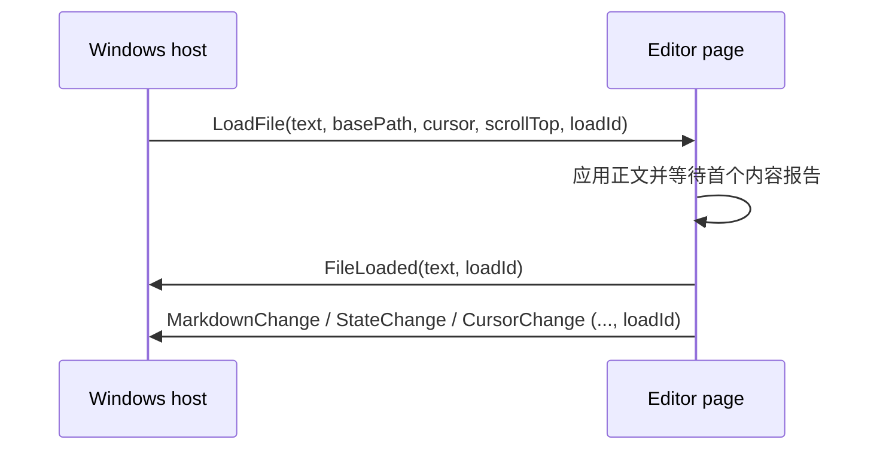

# WebView 消息协议

Typedown 的 Windows 宿主和编辑器页面通过 WebView2 字符串消息交换 JSON。宿主入口是 `Typedown.Services.Transport`，页面入口是 `Dev/Typedown.Editor/src/services/transport.ts`。

## 信封格式

页面到宿主有三种消息。

普通事件：

```json
{"type":"message","name":"FileLoaded","args":{"text":"# title","loadId":7}}
```

差分事件：

```json
{"type":"diffmsg","diff":false,"name":"MarkdownChange","args":"{\"text\":\"…\",\"loadId\":7}"}
```

后续同名消息可以只发送变化区间：

```json
{"type":"diffmsg","diff":true,"name":"MarkdownChange","args":"replacement","start":20,"end":24}
```

`start` 和 `end` 是上一份 JSON 字符串中的替换范围。第一次必须发完整基线。`OnScroll`、`SelectionFormats` 和 `SelectionChange` 的完全相同状态可以跳过；命令和生命周期消息不能去重。

页面调用宿主函数：

```json
{"type":"invoke","id":"invoke_12","name":"GetSettings","args":null}
```

宿主通过标准的宿主到页面信封，以请求 `id` 作为 `name` 返回：

```json
{"name":"invoke_12","args":{"code":0,"data":{}}}
```

失败响应为 `{"code":1,"msg":"…"}`。页面默认等待 30 秒，并在成功、失败、发送异常或超时后移除监听器。导出和打印显式关闭默认超时，因为其完成时间由系统对话框决定。

宿主到页面统一使用：

```json
{"name":"LoadFile","args":{"text":"# title","basePath":"…","loadId":7}}
```

`MarkdownEditor.PostMessage` 序列化该对象并调用 `PostWebMessageAsString`；页面按 `name` 分发。

## 文档加载握手



每次宿主加载文档都会递增 `loadId`。页面在所有文档相关报告中回传该值；宿主只接受当前值。快速切换时页面把同一帧内积压的 `LoadFile` 合并为最后一个。`FileLoaded.text` 是页面实际载入的 Markdown，用于建立已保存基线；不能用固定延迟猜测页面是否完成，也不能在握手过程中格式化源码。

保存、导出或关闭前，宿主发送：

```json
{"name":"FlushContent","args":{"token":18}}
```

页面立即完成节流中的正文报告并返回：

```json
{"type":"diffmsg","diff":false,"name":"ContentFlushed","args":"{\"token\":18,\"text\":\"…\"}"}
```

`token` 只完成对应等待。超时表示页面没有确认最新内容，调用方不能把它解释为“内容已同步”。

## 当前消息类别

| 方向 | 类别 | 主要名称 |
| --- | --- | --- |
| 页面 → 宿主事件 | 正文和生命周期 | `FileLoaded`, `MarkdownChange`, `ContentFlushed`, `StateChange`, `CursorChange`, `OutlineCurrent` |
| 页面 → 宿主事件 | 选择和滚动 | `SelectionChange`, `SelectionFormats`, `CodeMirrorSelectionChange`, `ReadingSelectionChange`（阅读模式下有没有选中文字：`{ selected }`，宿主据此启用复制）, `OnScroll`, `ScrollSettled` |
| 页面 → 宿主命令 | 系统动作 | `OpenURI` |
| 页面 → 宿主 invoke | 初始化和系统服务 | `ContentLoaded`, `GetSettings`, `GetCurrentTheme`, `GetStringResources`, `SetClipboard`, `OpenNewWindow`, `UnhandledException` |
| 页面 → 宿主 invoke | 导入导出工具 | `ExportCallback`, `PrintHTML`, `ResizeTable` |
| 宿主 → 页面 | 文档和模式 | `LoadFile`, `SetMarkdown`, `FlushContent`, `SettingsChanged`, `RestoreScroll` |
| 宿主 → 页面 | 编辑命令 | `Copy`, `Cut`, `Paste`, `SelectAll`, `DeleteSelection`, `Format`, `InsertTable`, `InsertImage`, `ReplaceImage` |
| 宿主 → 页面 | 查找和导航 | `Search`, `Find`, `Replace`, `SearchOpenChange`, `ScrollTo`, `OnScroll` |
| 宿主 → 页面 | 环境变化 | `ThemeChanged`, `LanguageChanged`, `Export`, `ImportFile` |

表格列出协议入口，具体 payload 以两端类型和处理器为准。`services/remote/common.ts` 中的 `LoadImage` 当前没有调用点和宿主处理器，不应作为可用协议使用；若恢复，必须同时实现并测试两端。

## 扩展协议

新增或修改消息时必须：

1. 明确方向和唯一名称，给 payload 写 TypeScript 类型和对应 C# 类型或字段校验。
2. 与文档有关的异步结果携带 `loadId`；请求响应使用不可复用 token/id。
3. 定义发送失败、页面重载、超时、迟到和重复消息的行为。
4. 只有幂等状态才能进入去重集合。打开链接、加载完成、保存确认等命令不得去重。
5. 差分协议必须先有同名完整基线；修改差分算法时覆盖发送失败和基线失步。
6. 日志记录名称、id、大小和错误类别，不记录整篇正文、剪贴板内容或凭据。
7. 运行 `transport.test.ts`，并用 `Tools/EditorBench` 的 handshake、reading/source、security 和 spec 检查验证构建产物。

协议当前仍以字符串名称和 `JToken` 为主。重构时应逐步建立共享的消息清单和 payload 验证，避免一次性改动全部调用点。
