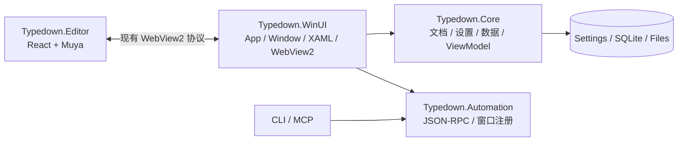

# Typedown 迁移到 WinUI 3 + .NET 10 执行方案

**文档状态**：执行基线

**迁移分支**：`migration/winui3-dotnet10`

**目标**：在不改写现有产品行为和用户数据的前提下，以 WinUI 3、Windows App SDK 和 .NET 10 替换旧的 XAML Islands / UWP XAML 宿主；Typedown 完成并通过全部门禁后，再由 Typeleaf 单向合并公共迁移成果。

## 1. 范围和不变项

本次迁移包含：

- 新建 WinUI 3 应用宿主，使用 Windows App SDK 和 .NET 10。
- 将 `Typedown.Core` 收敛为不依赖 UI 框架的平台中立逻辑层。
- 把窗口、对话框、文件选择器、剪贴板、拖放、快捷键、WebView2、激活和打包等 Windows 能力迁入 WinUI 宿主。
- 保留同进程多窗口、多标签、自动保存、备份、文件字节保真、自动化 API、CLI 和 MCP。
- 保留当前 MSIX、安装器和便携包的升级关系与用户数据位置。
- 为最终迁移 Typeleaf 保留稳定的 edition 扩展入口。

下列行为在迁移期间保持不变：

1. **不更换编辑器内核。** 继续使用当前 React + Muya 页面及其构建产物，不把迁移与 CodeMirror 或其他编辑器替换混在一起。
2. **不改编辑器协议。** `invoke`、`message`、`diffmsg`、宿主响应和错误响应的名称、字段、大小写与时序保持兼容。
3. **不改变文档格式。** 编码、BOM、换行符、Markdown 往返、保存前刷新和原子写入的现有语义保持不变。
4. **不改变用户数据位置和格式。** 迁移后的应用直接读取现有设置、数据库、会话、备份、主题和历史文件。
5. **不改变产品身份。** 包 Identity、Publisher、应用名、可执行文件名、文件关联和 CLI 别名必须从现有品牌配置与清单继承。
6. **不先做 Native AOT。** 第一阶段使用普通 .NET 10 发布；裁剪和 Native AOT 在功能等价后单独评估。
7. **不提前删除旧宿主。** 旧应用项目与现有 WAP 打包项目保留到新宿主通过完整测试和升级验证。
8. **明确支持架构。** 新 WinUI 宿主支持 x64 和 ARM64。x86 从未发布过安装包，本次明确停止支持；旧宿主残留的历史配置不进入迁移构建，并随旧宿主最后一起退出。

迁移提交只处理迁移本身。编辑器功能改进、协议重构、数据库重构和新产品功能应分别立项，避免无法判断回归来自哪一层。

## 2. 参考实现的使用边界

参考实现与当前 Typedown 在旧基线之后分别长期开发，不能整体合并，也不能批量 cherry-pick。以下提交只用于理解实现方法：

| 提交 | 可借鉴点 |
| --- | --- |
| `f5dc601f` | 最小 WinUI 3 应用壳和项目组织 |
| `cac38b3f`、`8014dabf`、`c228cbad` | 平台契约、WinUI 服务适配及语义校正 |
| `9591991b` | 对话框和文件选择器边界 |
| `6b18777a` | Dispatcher 与窗口上下文边界 |
| `27cd2a59` | 应用激活边界 |
| `7931addf` | ARM64 工程配置和项目命名收口 |
| `8d42b592`、`94138c13`、`527cff53`、`8d852f39`、`83113c48` | `AppInstance` 激活转发、启动竞态、超时和取消处理 |
| `da5ff4b0` | 在 WinUI 3 中承载原有 Muya 编辑器的 WebView2 宿主方法 |
| `378d2d60` | 将前端构建与 MSBuild 解耦，避免 npm 修改 Yarn 工程 |
| `59e012fa`、`a4a1abe2`、`69c45464` | 将反射绑定逐步改为编译绑定的方法 |
| `6a287042` | 功能稳定后再启用裁剪和 Native AOT 的检查方法；本次初始迁移不启用 |

参考代码中的窗口模型、编辑器实现、主题模型、包身份和功能集合均不是当前产品基线。迁移时只手工移植已经核对过的宿主模式，不复制整棵目录。

## 3. 目标架构



最终依赖方向为：

```text
Typedown.WinUI -> Typedown.Core
Typedown.WinUI -> Typedown.Automation
Typedown.WinUI -> Typedown.Editor 的静态产物
CLI / MCP -> Typedown.Automation
```

禁止下列依赖：

- `Typedown.Core -> Microsoft.UI.Xaml`
- `Typedown.Core -> Windows.UI.Xaml`
- `Typedown.Core -> Microsoft.Web.WebView2`
- `Typedown.Core -> Typedown.WinUI`
- `Typedown.Automation -> 具体 XAML 控件`
- 编辑器页面直接访问本地文件系统或应用数据库

迁移期间允许旧项目继续引用原有 UWP 类型，但新建的 .NET 10 Core 和 WinUI 项目必须遵守上述方向。切换完成后再删除临时兼容项目或兼容文件。

## 4. 模块映射

| 当前模块或职责 | 目标位置 | 迁移要求 |
| --- | --- | --- |
| `Dev/Typedown/Program.cs`、`App.cs` | `Dev/Typedown.WinUI/Program.cs`、`App.xaml.cs` | 使用 WinUI 3 `Application.Start` 与 `AppInstance`，保留单实例和文件激活 |
| `MainWindow`、窗口列表与关闭流程 | `Typedown.WinUI` 的 `WindowManager` / `WindowSession` | 继续支持同进程多窗口；每个窗口单独 DI scope |
| `Typedown.XamlUI` 宿主 | 无 | 新宿主等价后删除，不进入目标依赖图 |
| Core 中的页面、控件、Converter、资源字典 | `Typedown.WinUI` | 从 `Windows.UI.Xaml` 迁到 `Microsoft.UI.Xaml`，保持现有布局和命令 |
| Core 中的 ViewModel、文档流程、设置模型 | `Typedown.Core` | 清除平台 UI 类型，目标为 SDK-style `net10.0` 类库 |
| Picker、Dialog、Clipboard、Drag/Drop、Dispatcher | Core 定义接口，WinUI 实现 | 请求和结果 DTO 不暴露 WinRT/XAML 类型 |
| `MarkdownEditor`、`WebViewController` | WinUI `WebView2` 控件和宿主适配器 | 保留 Muya 协议，删除旧 CompositionController 反射桥 |
| 编辑器页面 | `Typedown.Editor` | 迁移期间冻结内核和协议，只允许宿主兼容所需的小改动 |
| 自动化窗口和文档适配 | `Typedown.Automation` + WinUI adapter | 协议与方法名不变，窗口注册改接 `WindowManager` |
| CLI / MCP | 原工具项目 | 在宿主稳定后迁到 .NET 10，保持命令名、输出和错误码 |
| WAP/MSIX、安装器、便携包 | 先保留；验证后接入新 WinUI 输出 | 不先删除任何现有发布形态 |
| edition 扩展入口 | Core 中的平台中立契约 + WinUI 中的 UI 贡献点 | 公共接口先在 Typedown 定义，Typeleaf 最后适配 |

### 4.1 过渡项目策略

为了让迁移过程保持可构建，采用并行宿主：

1. 先新增 `Typedown.WinUI`，旧 `Typedown` 与旧打包项目继续存在。
2. 平台接口先从混合 Core 中抽出；必要时可建立临时 contracts 项目，让旧宿主和新宿主共同引用。
3. 业务类逐批去除 UWP 类型后进入 SDK-style .NET 10 Core。
4. 新宿主达到功能等价后，将临时 contracts 合回 Core，并在单独提交中删除旧宿主。

不通过全局替换 `Windows.UI.Xaml` 为 `Microsoft.UI.Xaml` 开始迁移。每批先确定该类型应留在 UI 层还是变成平台中立契约，再移动代码。

## 5. DI 与生命周期边界

### 5.1 进程级单例

下列对象在整个进程中只有一个实例：

- 设置存储及设置变更广播。
- 数据库连接管理、schema 检查和 SQLite 初始化。
- 自动化服务监听器、会话管理与窗口注册表。
- `AppInstance` 激活 broker。
- WebView2 environment 与固定的 user-data folder 配置。
- 日志、远程服务客户端和不含窗口状态的文件服务。
- 主题文件目录监视器；它把变更广播给各窗口，不直接持有 XAML 控件。

进程级服务不得保存某个窗口的 `Window`、`XamlRoot`、Dispatcher、菜单项或 WebView2 控件。设置写入后必须通知所有窗口；关闭一个窗口不能释放进程级服务。

### 5.2 每窗口 scope

每次创建窗口时创建一个 `WindowSession` 和一个 DI scope，至少包含：

- `Window`、`IWindowContext`、`IUiDispatcher`。
- `AppViewModel`、`TabsViewModel`、`FileViewModel`、`EditorViewModel`、格式、段落和 UI ViewModel。
- 当前窗口的 WebView2、Muya bridge 和编辑会话。
- Dialog、Picker、快捷键、浮动面板、拖放和窗口关闭协调器。
- 当前窗口的自动化 adapter 和窗口 ID。
- 每窗口创建的菜单、资源引用与 edition UI 贡献。

窗口关闭顺序固定为：

1. 阻止重复关闭请求。
2. 刷新编辑器正文并执行自动保存。
3. 对全部标签执行未保存确认。
4. 保存标签会话、窗口位置和最后一次设置快照。
5. 从自动化窗口注册表注销。
6. 取消 WebView2、文件监视器和 Dispatcher 回调。
7. 释放窗口 scope 和 XAML 对象。
8. 若无窗口且未启用后台驻留，再结束进程。

任何静态字段都不能持有 `Brush`、`FontFamily`、`MenuFlyoutItem`、`FrameworkElement` 或其他 XAML 对象。需要共享的只有不可变数据；UI 对象由窗口 scope 创建。

### 5.3 瞬时对象

对话框实例、picker 请求、导出任务、一次性通知和临时文件上下文使用 transient 或普通局部对象。它们必须从当前 `WindowSession` 取得 HWND 或 `XamlRoot`，不能使用“最后活动窗口”作为隐式全局 owner。

## 6. 迁移里程碑

### M0：冻结基线和建立迁移门禁

**目标**：明确迁移起点，并让新增架构检查在旧代码上先失败。

工作项：

- 记录迁移起点提交、当前版本、支持架构和发布形式。
- 记录当前完整自动化、编辑器测试、可靠性测试和打包结果。
- 新增架构检查：要求存在并行 WinUI 项目、目标为 .NET 10、启用 WinUI 3、保留旧项目、关闭 AOT/裁剪并只面向 x64、ARM64。
- 在创建 WinUI 项目前运行检查，确认它因缺少目标项目而失败；之后才进入 M1。
- 建立迁移缺口表，每一项关联测试或人工验收步骤。

完成标准：

- 旧宿主仍能按现有流程构建和运行。
- 当前全部自动化与编辑器基线通过。
- 架构检查能证明目标项目尚未落地，而不是空跑成功。

### M1：建立并行 WinUI 3 + .NET 10 宿主

**目标**：在不动旧启动路径的情况下，构建并启动最小 WinUI 窗口。

工作项：

- 新建 `Dev/Typedown.WinUI/Typedown.WinUI.csproj`。
- 目标框架使用 `net10.0-windows...`，启用 `<UseWinUI>true</UseWinUI>`。
- 直接固定 Windows App SDK 版本；先关闭 `PublishAot` 与 `PublishTrimmed`。
- 导入 `Branding.props`，应用名、程序集名和资源路径不写死。
- 配置 x64、ARM64；Debug_Local 提供无需安装证书的开发入口。
- 新增 `Program`、`App`、最小 `Window` 和原生标题栏骨架。
- 旧 `Dev/Typedown` 与 WAP 项目不删除、不改为指向半成品宿主。

完成标准：

- 新项目可恢复、编译并显示窗口。
- 旧项目仍可构建。
- WinUI 项目不引用 `Typedown.XamlUI`。
- 架构测试由失败转为通过。

### M2：抽离平台契约并建立 .NET 10 Core

**目标**：让业务逻辑不再依赖 UWP XAML 和旧宿主。

优先抽取下列接口：

- `IAppDataPathProvider`
- `IUiDispatcher`
- `IWindowContext`
- `IDialogService`
- `IFilePickerService`
- `IClipboard`
- `IFileOperation`
- `IFileExport` / `IFileConverter`
- `IKeyboardAccelerator`
- `IAppActivationService`
- `IMarkdownEditorBridge`

工作项：

- 接口只使用字符串、流、枚举、record/DTO、`CancellationToken` 和普通 .NET 类型。
- 逐处移除 ViewModel 中直接创建 picker、dialog、Dispatcher 或访问 XAML root 的代码。
- 将设置、标签、文档、备份、历史和数据库服务迁到 SDK-style `net10.0` Core。
- 为每个接口建立 fake，实现不启动 WinUI 的单元测试。
- 添加依赖守卫，Core 一旦引用 XAML、WebView2 或 WinUI 包就失败。
- 先保持当前序列化库和数据库 schema；不要同时切到新的 JSON 形状或手写 SQLite。

完成标准：

- Core 单元测试可在不启动 Windows UI 的情况下运行。
- Core 项目不含 UI 页面和控件，也不引用任何 XAML/WebView2 程序集。
- 设置和数据库兼容测试能读取当前稳定版生成的 fixture。

### M3：实现同进程多窗口与激活

**目标**：用 WinUI 3 恢复当前窗口、标签和单实例行为。

工作项：

- 实现进程级 `WindowManager` 和每窗口 `WindowSession`。
- 每个窗口建立独立 DI scope、WebView2、ViewModel 和窗口 ID。
- 普通二次启动和文件关联激活通过 `AppInstance` 转发到主实例。
- “新窗口”在同一进程中创建新 `WindowSession`，不退化为一窗口一进程。
- 保留“在当前活动窗口新标签打开”与“强制新窗口”的现有选择规则。
- 迁移窗口位置、前置、置顶、全屏、Mica、标题栏、关闭确认和后台驻留。
- 将自动化窗口注册表接到新 WindowManager，但此阶段可只做窗口发现和激活 smoke。

必须新增的测试：

- 连续二次启动只产生一个主实例。
- 文件关联激活在正确窗口中打开文件。
- 两窗口各自拥有独立标签、快捷键、对话框 owner 和主题 UI 对象。
- 关闭一个窗口不影响另一个窗口及进程级设置服务。
- 最后一个窗口关闭时，保存、注销和退出顺序正确。

完成标准：

- 两个窗口可同时编辑不同文档。
- 多窗口关闭和重开不留下无窗口后台进程。
- 不存在跨窗口共享 XAML 对象或跨 Dispatcher 访问。

### M4：迁移 XAML 外壳、设置与主题

**目标**：恢复当前可见 UI 和设置行为。

推荐顺序：

1. 资源字典、字符串、图片和 Converter。
2. Root、Frame、标题栏、菜单栏和状态栏。
3. 左侧文件树、大纲和搜索面板。
4. 多标签栏和标签上下文菜单。
5. 设置页面、快捷键编辑和导入/导出配置。
6. 浮动面板、图片工具、表格工具和对话框。

实现要求：

- XAML 改用 `Microsoft.UI.Xaml`，资源字符串继续来自当前资源文件。
- `ContentDialog` 必须设置当前窗口的 `XamlRoot`。
- `FileOpenPicker`、`FileSavePicker` 和 `FolderPicker` 必须用当前窗口 HWND 初始化。
- 优先保持现有绑定语义；功能等价后再分批转换为 `x:Bind`。
- 保留系统主题、自定义主题、编辑器主题 CSS、标签颜色变量、排版 preset 和热更新。
- 设置变更由进程级 store 写一次，并广播到所有窗口各自的 Dispatcher。
- 保留全屏、置顶、动画、侧栏、状态栏和窗口位置设置。
- 保留 IME、中文剪贴板、快捷键和文件拖放行为。

完成标准：

- 当前设置页的全部选项可以读取、修改、持久化并在重启后恢复。
- 主题和排版 preset 在两个窗口中实时更新，不产生跨线程异常。
- 文件树、大纲、多标签、菜单勾选和对话框 owner 与旧版一致。

### M5：接入当前 Muya、完整文档流程和自动化

**目标**：在 WinUI WebView2 控件中恢复编辑、保存、导出和外部观察能力。

WebView2 宿主职责：

- 进程级共享 `CoreWebView2Environment`，每个窗口创建自己的 WebView2 控件。
- 使用固定 user-data folder 和与当前版本兼容的浏览器参数。
- 正确处理 Loaded/Unloaded、导航取消、页面 ready、进程退出和窗口释放。
- 页面之外的导航交给系统浏览器，不允许替换编辑器页面。
- 本地图片读取受路径、类型和大小限制；页面不能借此读取任意本地文件。
- 首帧背景、主题切换、DPI、焦点、右键菜单、滚动和快捷键与现有行为一致。

协议要求：

- 继续加载当前 `Typedown.Editor` 构建产物。
- 冻结现有消息名称、字段大小写、返回码和调用顺序。
- 把 WebView2 的物理收发放在 WinUI 层；协议分发和文档状态放在 Core/Automation 层。
- 保存、另存、导出、切换标签和关闭前必须完成正文刷新。
- 页面重载或渲染进程退出时，恢复过程不得覆盖宿主中更新的正文。
- 自动化 API 对设置和正文的修改应立即广播并显示在对应窗口中。

恢复顺序：

1. 页面握手与空文档。
2. 打开、编辑、保存、另存和字节保真。
3. 源码/阅读模式、撤销重做和标签切换。
4. 大纲、查找替换、图片、表格、公式和 Mermaid。
5. 主题、排版 preset 与自定义 CSS。
6. HTML、图片和 PDF 导出及打印。
7. 自动化 API、CLI 和 MCP 的完整窗口/文档/设置方法。

完成标准：

- 当前编辑器单元测试和 EditorBench 全部通过。
- 完整 Windows E2E 在新宿主上通过。
- 自动化客户端能设置、编辑、读取和观察窗口中的实时结果。
- 大文档输入性能、启动时间和双窗口内存没有不可解释的显著退化。

### M6：打包、升级和发布链迁移

**目标**：让新 WinUI 宿主替代旧可执行文件，同时保持安装升级关系。

工作项：

- 从现有清单继承 MSIX Identity、Publisher、版本、文件关联、显示名、语言和 Store association。
- 从 `Branding.props` 生成程序集名、可执行文件名、CLI 名和包名。
- 保留 CLI/MCP 的 `appExecutionAlias` 及包内文件布局。
- 先让现有 WAP 项目可以打包新宿主；单项目 MSIX 只有在输出等价后才能替换 WAP。
- 安装器和便携包必须包含 Windows App Runtime，或采用经过验证的自包含发布；不能假设目标机器预装运行时。
- 第一版继续使用 ReadyToRun 或普通发布，不启用 Native AOT 与裁剪。
- 构建脚本必须拒绝把 AutomationTestHost 当成正式安装包。
- CI 同时构建 x64、ARM64，并验证包内编辑器、主题、CLI 和许可证文件。

升级测试矩阵：

1. 安装当前稳定版并创建设置、数据库记录、标签会话、备份和自定义主题。
2. 原位安装 WinUI 迁移版。
3. 验证原有数据全部可读，文件关联和 CLI alias 仍可用。
4. 编辑并保存已有文档，确认编码、BOM 和换行符未变化。
5. 卸载/重装时核对用户数据策略与当前版本一致。
6. 分别验证 MSIX、安装器和便携包的首次启动与升级。

完成标准：

- 包 Identity 未变化，现有安装可直接升级。
- 新包不会建立第二份设置目录或空数据库。
- 三种发布形态均能在干净系统上启动并加载编辑器。
- 签名、版本和清单检查通过。

### M7：Typedown 切换完成，再迁移 Typeleaf

**目标**：先完成公共底座，再单向把迁移成果合入 Typeleaf。

Typedown 切换条件：

- M0～M6 的自动检查和人工验收全部通过。
- 新宿主通过完整 Windows E2E，偶发失败已经定位，不以简单重跑掩盖。
- 新安装和原位升级均通过。
- 旧宿主只在此时从默认 solution、CI 和打包入口移除。
- 删除旧宿主前保留清晰的回滚提交点。

Typeleaf 迁移顺序：

1. 从完成的 Typedown 迁移分支单向合并公共代码。
2. 接入 Typeleaf 自己的品牌配置、包 Identity、资源和清单。
3. 将 edition UI 适配到 `Microsoft.UI.Xaml`，保持每窗口创建和释放。
4. 迁移 edition 的平台中立服务，再迁移依赖窗口、菜单和对话框的功能。
5. 运行 Typedown 公共测试，再运行 Typeleaf 自己的测试与打包检查。
6. Typeleaf 验证完成后才移除它的旧宿主和旧打包入口。

合并方向始终是 Typedown → Typeleaf。迁移期间发现的公共缺陷先在 Typedown 修复、测试和提交，再合并到 Typeleaf；不把 Typeleaf 分支反向合入 Typedown，也不把 edition 实现带入公开 Core。

## 7. Muya 协议兼容规则

迁移后的 `IMarkdownEditorBridge` 只隔离传输，不重新定义协议。

| 方向 | 当前语义 | 迁移要求 |
| --- | --- | --- |
| 页面 → 宿主 `invoke` | 有请求和响应的调用 | 方法名、参数 JSON、成功/错误码保持一致 |
| 页面 → 宿主 `message` | 状态或事件上报 | 顺序与线程切换不得丢消息 |
| 页面 → 宿主 `diffmsg` | 正文增量同步 | 继续应用当前差分规则，不在宿主迁移中改算法 |
| 宿主 → 页面 | 调用编辑器方法、设置和主题 | 方法名、字段大小写与时序保持一致 |
| 自动化 → Core → 页面 | 设置、编辑与视图操作 | 修改成功后在同一 revision 内反映到可见页面 |

需要建立协议 fixture，至少覆盖：初始化、加载、正文变化、刷新正文、选区、撤销重做、模式切换、主题、设置、图片、导出和错误响应。C# 和页面测试读取同一组样例，字段变化必须显式更新基线。

正文同步的版本号或重同步协议属于迁移后的独立可靠性工作。在 M5 完成前，不借机改变现有差分协议。

## 8. 数据和设置兼容

迁移版必须继续识别现有数据根目录及下列内容：

| 内容 | 当前名称或位置 | 兼容要求 |
| --- | --- | --- |
| 设置 | `Settings.json` | 保留字段名、大小写、默认值和未知字段处理 |
| 数据库 | `Storage.db` | 保留表、列、迁移历史和日期格式 |
| 标签会话 | `session.json` | 原有窗口关闭后可在新宿主恢复 |
| 光标记录 | `cursors.json` | 文档重开位置一致 |
| 自动备份 | `Backup/` | 已保存与未命名文档均可恢复 |
| 自定义主题 | `themes/` | CSS 与元数据继续加载，设计器入口仍可用 |
| 上传历史 | `ImageUploadHistory.json` | 不因运行时升级而清空 |
| 其他本地状态 | 现有 JSON 与日志目录 | 路径和清理策略保持一致 |

实现规则：

- 打包版保持现有包 Identity，继续使用同一个 `ApplicationData` 根目录。
- 非打包版继续使用现有品牌目录，不新建带 `.WinUI` 或版本号的目录。
- 自动化测试宿主仍使用隔离数据根，绝不能读写用户正式数据。
- 设置仍由每个数据文件对应的共享 store 串行写入并使用原子替换。
- 在迁移完成前不同时更换 Newtonsoft.Json 与 System.Text.Json。若以后更换，需为每个持久化文件建立双向 fixture 测试。
- EF Core 升级到 .NET 10 兼容版本时，先对稳定版数据库副本做只读 schema 对比；未经迁移不得重建数据库。
- 数据库迁移必须可重复、可中断恢复，并保留失败前文件。schema 变化必须有旧版 fixture、升级测试和故障注入测试。
- 文档文件仍通过现有字节保真层读取和写入；UI 迁移不得绕过它直接调用 `File.ReadAllText` / `WriteAllText`。

## 9. 打包和升级约束

新工程文件可以借鉴单项目 MSIX 的组织方式，但最终发布清单以当前产品清单为准。迁移版不得使用临时测试 Identity 覆盖正式 Identity，也不得把开发证书加入仓库。

必须保留：

- 当前所有文件扩展名关联和 ContentType。
- 多语言资源声明与品牌资源。
- CLI/MCP 的执行别名。
- 包内编辑器静态文件、内置主题、主题设计器和许可证。
- 测试构建标签与稳定版无标签的现有规则。
- MSIX、安装器、便携包各自的输出和版本校验。

正式切换前对包内容做清单比较。允许变化的项目只有 WinUI 3 / .NET 10 运行时和新宿主文件；用户可见资源、工具和文档缺失均视为失败。

## 10. 测试门禁

### 10.1 每个里程碑的固定流程

1. 为新边界或故障先写检查。
2. 在旧实现或缺少实现的状态下运行，确认检查按预期失败。
3. 完成最小实现。
4. 运行受影响测试并修复。
5. 运行该里程碑的完整门禁。
6. 记录构建提交、平台、配置和测试结果。

没有真实失败记录的新检查不能作为迁移完成证据。

### 10.2 静态与单元门禁

- WinUI migration architecture tests。
- Core 依赖守卫：不得引用 UWP/WinUI/WebView2。
- `python3 Tools/Translations/check.py --strict`。
- `python3 Tools/Branding/check-brand.py`。
- `python3 Tools/Docs/testing-index.py`。
- Core、Automation、可靠性和持久化测试全部通过。
- 数据 fixture：稳定版 `Settings.json`、`Storage.db`、session、backup、theme 可被迁移版读取。

### 10.3 编辑器门禁

- Yarn lockfile 冻结安装。
- 编辑器单元测试全部通过。
- 生产 bundle 成功构建，MSBuild 不运行 `npm install`，也不生成第二个 lockfile。
- EditorBench 的协议、模式切换、粘贴、表格、Mermaid、主题、导出、字节往返、安全和大文档检查全部通过。
- 当前 bundle 在旧宿主和新宿主中的关键行为一致，差异必须进入显式基线。

### 10.4 Windows 集成门禁

- 使用固定的 .NET 10 SDK 在 Windows 构建机分别验证 x64 和 ARM64 目标，并记录 SDK、提交和配置。
- Debug_Local 首次启动、二次启动、文件关联激活。
- 双窗口、多标签、关闭确认、会话恢复和最后窗口退出。
- Picker、Dialog、拖放、中文与特殊字符剪贴板、IME、快捷键和右键菜单。
- 主题、排版 preset、文件热更新和多窗口广播。
- HTML、图片、PDF 导出和打印。
- 自动化 API、CLI、MCP 的设置、编辑、观察和错误传播。
- 完整 Windows E2E 全绿；失败必须保留日志和截图并分类。

### 10.5 发布门禁

- MSIX、安装器、便携包均在干净环境启动。
- 当前稳定版到迁移版的原位升级通过。
- 版本号、包 Identity、Publisher、架构、签名和清单一致性检查通过。
- 包内文件清单检查通过，CLI alias 可调用。
- 启动时间、编辑延迟、保存耗时、两窗口内存和退出后残留进程与基线比较。
- 任何必跑测试失败、偶发失败未定位或数据升级未验证时，不生成发布候选包。

### 10.6 Typeleaf 门禁

Typeleaf 在 M7 中先运行全部 Typedown 公共门禁，再运行自己的 edition、品牌、包清单、升级和 Windows E2E。公共测试失败时回 Typedown 修复；edition 测试失败时只在 Typeleaf 处理对应适配。

## 11. 提交边界和回滚点

建议每个里程碑至少保留一个可构建提交，提交内容按下列边界拆分：

1. 测试基线或失败检查。
2. 项目文件和依赖。
3. Core 契约与业务迁移。
4. WinUI 平台实现。
5. XAML/资源迁移。
6. 测试修复和文档更新。

不要把项目转换、编辑器协议变化、数据库重构和打包切换放在同一个提交。M3、M5、M6 完成后分别保留明确的回滚点；删除旧宿主必须是最后一个独立提交。

## 12. 完成定义

当且仅当满足以下条件，Typedown 的迁移才算完成：

- 默认 Windows 应用由 WinUI 3 + Windows App SDK + .NET 10 构建。
- 运行时不再依赖 `Typedown.XamlUI`、UWP XAML Islands 或 .NET Core 3.1。
- Core 不引用任何 UI 框架。
- 当前 Muya 编辑器、自动化 API、CLI/MCP、多窗口、多标签、主题、排版、导出和打印功能等价。
- 现有设置和数据库无需人工转换即可继续使用。
- MSIX、安装器和便携包均通过首次安装与升级测试。
- 完整自动化、编辑器、可靠性和 Windows E2E 全部通过。
- Typeleaf 尚未被提前混入；它只在上述条件满足后执行 M7 的单向合并和适配。
